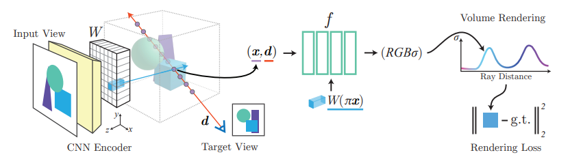
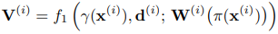
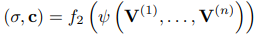
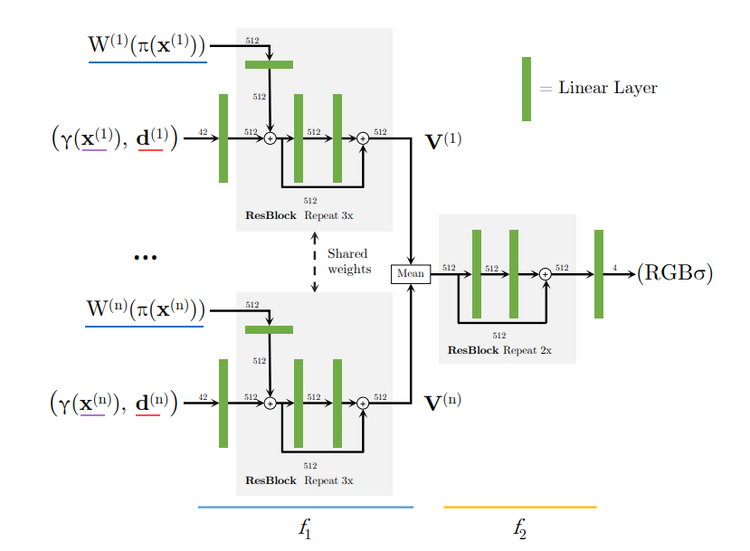
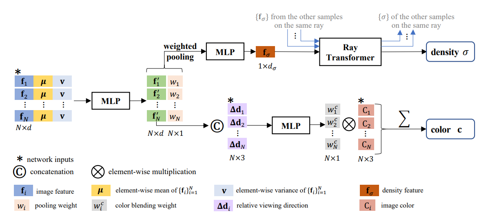
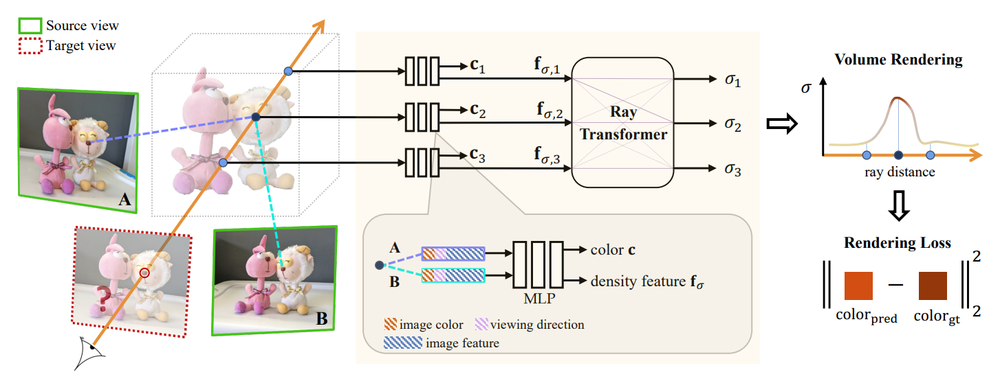
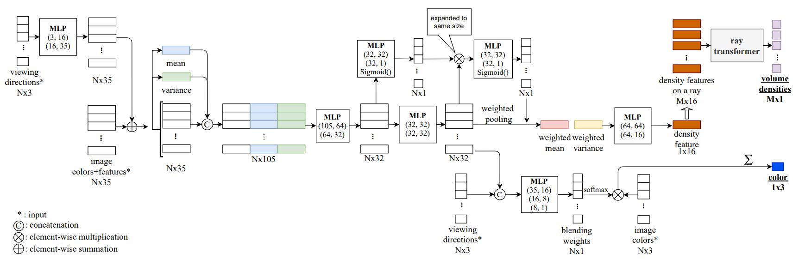

<!-- markdownlint-disable MD024 -->
# Meeting Logs

## Meeting 2

### Papers

1. [pixelNeRF: Neural Radiance Fields from One or Few Images](https://arxiv.org/pdf/2012.02190.pdf)
2. [IBRNet: Learning Multi-View Image-Based Rendering](https://arxiv.org/pdf/2102.13090.pdf)
3. [Scene Representation Transformer](https://arxiv.org/pdf/2111.13152.pdf)
4. [MVSNeRF: Fast Generalizable Radiance Field Reconstruction from Multi-View Stereo](https://arxiv.org/pdf/2103.15595.pdf)

### pixelNeRF

Github repository [here](https://github.com/sxyu/pixel-nerf)

#### Paper Interpretation

1. Kernel: predict a continuous neural scene representation conditioned on `one or few` input images.
2. Abstract:
    - How: introduct an architecture that conditions a NeRF on image inputs in a fully convolutional manner.
    - Benefit:
        - Allows the network to be trained across multiple scenes to learn a scene prior, enabling it to perform novel view synthesis in a feed-forward manner from a sparse set of views.
        - Model can be trained directly from images with no explicit 3D supervision.
3. Introduction:
    - pixelNeRF takes spatial image features aligned to each pixel as an input.
    - pixelNeRF can be trained on a dataset of multi-view without additional supervision such as ground truth 3D shape or object masks.
    - pixelNeRF predicts a NeRF representation in the camera coordinate system.
    - pixelNeRF can preserve the spatial alignment between the image and the output 3D representation.
    - pixelNeRF can incorporate a variable number of posed input views at test time without requiring any test-time optimization.
4. Image-conditioned NeRF:
    - Single-Image pixelNeRF:
        - Pipeline:
            
            - Given an input image I of a scene, first extract a feature volume W = E(I).
            - Then, for a point on a camera ray x, retire the corresponding image feature by projecting x onto the image plane coordinates π(x).
            - Then bilinearly interploating between the pixelwise features to extract the feature vector W(π(x)).
            - Finally, pass the image feature into the NeRF network along with the position and view direction.
        - Addition:
            - In the multi-view case, view directions could serve as a signal for th erelevance and positioning of different views.
            - Therefore, input the view direction at the begining of the NeRF network.
    - Incorporating Multiple Views:
        - First, encode each input image into feature volume W(i) = E(I(i)).
        - For each view-space x(i), extract the corresponding image feature from the feature volume W(i) at the projected image coordinate π(x(i)).
        - Then pass these inputs into f1 to obtain intermediate vectors if witch f1 is the initial layers of the NeRF network:
            
        - The intermediate V(i) are then aggregated with the average pooling operator and passed into the final layers f2 to obtain the predicted density and color:
            
5. Discussion:
    - Rendering time is slow, and time increases linearly when given more input views.
    - NeRF-based representations can't be converted to meshes very reliably.
    - Making NeRF-related methods scale-invariant is a crucial challenge.
    - DTU s dataset was captured under controlled settings and has matching camera poses across all scenes with limited viewpoints.
    - The approach is bottlenecked by the avaliability of large-scale wide baseline muti-view datasets.
6. Implementation Details:
    
    - Encoder:
        - Use a ResNet34 backbone and extract a feature pyramid by taking the feature maps prior to the first pooling peration and after the first ResNet 3 layers.
        - For a *H X W* image, the feature maps have shapes:
            - *64 x H/2 x W/2*
            - *64 x H/4 x W/4*
            - *128 x H/8 x W/8*
            - *256 x H/16 x W/16*
        - These are upsampled bilinearly to H/2 × W/2 and concatenated into a volume of size 512 × H/2 × W/2.
        - For 64 x 64 images, to avoid losing too much resolution, skio the first pooling layer, so that the image resolutions are 1/2, 1/2, 1/4, 1/8
    - NeRF network

#### Run the Model

1. Following the document, I ran the model on the DTU dataset successfully.
2. During running, problem `pytorch pyparsing.exceptions.ParseSyntaxException: Expected '}', found '='` occurred. The reason is the version of `pyparsing`, the latest version no longer support some characters. Installing old version (3.0.0 works) would help.
3. Results:
    
    Rendering Video [here](./image_note/pixelNeRF_Video.mp4)

#### Code Pipeline

1. Catalog architecture:

    ```text
    pixelnerf
     |____ src
     |      |____ util
     |      |      |____ __init__.py
     |      |      |____ args.py
     |      |      |____ recon.py
     |      |      |____ util.py
     |      |____ data
     |      |      |____ __init__.py
     |      |      |____ data_util.py
     |      |      |____ DVRDataset.py
     |      |      |____ MulyiObjectDataset.py
     |      |      |____ SRNDataset.py
     |      |____ render
     |      |      |____ __init__.py
     |      |      |____ nerf.py
     |      |____ model
     |             |____ __init__.py
     |             |____ code.py
     |             |____ custom_encoder.py
     |             |____ encoder.py
     |             |____ loss.py
     |             |____ mlp.py
     |             |____ model_util.py
     |             |____ models.py
     |             |____ resnetfc.py
     |____ train
            |____ trainlib
            |      |____ __init__.py
            |      |____ trainer.py
            |____ train.py
    ```

2. render: forward process of `NeRFRender`:
    - coarse sampling:

        ```python
        z_coarse = self.sample_coarse(rays)  # (B, Kc)
        coarse_composite = self.composite(
            model, rays, z_coarse, coarse=True, sb=superbatch_size,
        )
        ```

    - coarse output:

        ```python
        outputs = DotMap(
            coarse=self._format_outputs(
                coarse_composite, superbatch_size, want_weights=want_weights,
            ),
        )
        ```

    - fine sampling and output:

        ```python
        if self.using_fine:
            all_samps = [z_coarse]
            if self.n_fine - self.n_fine_depth > 0:
                all_samps.append(
                    self.sample_fine(rays, coarse_composite[0].detach())
                )  # (B, Kf - Kfd)
            if self.n_fine_depth > 0:
                all_samps.append(
                    self.sample_fine_depth(rays, coarse_composite[2])
                )  # (B, Kfd)
            z_combine = torch.cat(all_samps, dim=-1)  # (B, Kc + Kf)
            z_combine_sorted, argsort = torch.sort(z_combine, dim=-1)
            fine_composite = self.composite(
                model, rays, z_combine_sorted, coarse=False, sb=superbatch_size,
            )
            outputs.fine = self._format_outputs(
                fine_composite, superbatch_size, want_weights=want_weights,
            )
        ```

3. model:
    - Positional Encoding:

        ```python
        with profiler.record_function("positional_enc"):
            embed = x.unsqueeze(1).repeat(1, self.num_freqs * 2, 1)
            embed = torch.sin(torch.addcmul(self._phases, embed, self._freqs))
            embed = embed.view(x.shape[0], -1)
            if self.include_input:
                embed = torch.cat((x, embed), dim=-1)
            return embed
        ```

    - Encoders:
        - `ConvEncoder`: named custom_encoder
            - Architecture:

                ```python
                # network architecture
                self.dim_in = dim_in
                self.norm_layer = norm_layer
                self.activation = nn.LeakyReLU() if use_leaky_relu else nn.ReLU()
                self.padding_type = padding_type
                self.use_skip_conn = use_skip_conn

                first_layer_chnls = 64
                mid_layer_chnls = 128
                last_layer_chnls = 128
                n_down_layers = 3
                self.n_down_layers = n_down_layers

                self.conv_in = nn.Sequential(
                    nn.Conv2d(chnls, 2 * chnls, kernel_size=3, stride=2, bias=False),
                    norm_layer(2 * chnls),
                    self.activation,
                )

                chnls = first_layer_chnls
                for i in range(0, n_down_layers):
                    conv = nn.Sequential(
                        nn.Conv2d(chnls, 2 * chnls, kernel_size=3, stride=2, bias=False),
                        norm_layer(2 * chnls),
                        self.activation,
                    )
                    setattr(self, "conv" + str(i), conv)

                    deconv = nn.Sequential(
                        nn.ConvTranspose2d(
                            4 * chnls, chnls, kernel_size=3, stride=2, bias=False
                        ),
                        norm_layer(chnls),
                        self.activation,
                    )
                    setattr(self, "deconv" + str(i), deconv)
                    chnls *= 2

                self.conv_mid = nn.Sequential(
                    nn.Conv2d(chnls, mid_layer_chnls, kernel_size=4, stride=4, bias=False),
                    norm_layer(mid_layer_chnls),
                    self.activation,
                )

                self.deconv_last = nn.ConvTranspose2d(
                    first_layer_chnls, last_layer_chnls, kernel_size=3, stride=2, bias=True
                )

                self.dims = [last_layer_chnls]
                ```

            - Forward process:

                ```text
                # padding, unpadding, reshape,etc. were omitted

                       x, image input, 3 channels
                       ↓
                  +---------+
                  | conv_in | 3 -> 64
                  +---------+
                       ↓
                  +--------+
                  | conv_i | x 3, 64 -> 128
                  +--------+
                       ↓
                 +----------+
                 | conv_mid | 128 -> 256
                 +----------+
                       ↓
                 +----------+
                 | decode_i | x3, 256 -> 64
                 +----------+
                       ↓
                +-------------+
                | decode_last | 64 -> 128
                +-------------+
                       ↓
                     output
                ```

        - `SpatialEncooder`: 2D image encoder

            ```python
            # part of __init__()
            if self.use_custom_resnet:
                self.model = ConvEncoder(3, norm_layer=norm_layer)
                self.latent_size = self.model.dims[-1]
            else:
                self.model = getattr(torchvision.models, backbone)(
                    pretrained=pretrained, norm_layer=norm_layer
                )
                self.latent_size = [0, 64, 128, 256, 512, 1024][num_layers]
            
            # forward process, for extracting ReSNet's features.
            # x is the input image (B, C, H, W)
            # return latent(B, latent_sizem, H, W)
            if self.use_custom_resnet:
                self.latent = self.model(x)
            else:
                x = self.model.conv1(x)
                x = self.model.bn1(x)
                x = self.model.relu(x)

                latents = [x]
                if self.num_layers > 1:
                    if self.use_first_pool: # use first pool if image is of adequate size
                        x = self.model.maxpool(x)
                    x = self.model.layer1(x)
                    latents.append(x)
                if self.num_layers > 2:
                    x = self.model.layer2(x)
                    latents.append(x)
                if self.num_layers > 3:
                    x = self.model.layer3(x)
                    latents.append(x)
                if self.num_layers > 4:
                    x = self.model.layer4(x)
                    latents.append(x)

                self.latents = latents
                align_corners = None if self.index_interp == "nearest" else True
                latent_size = latents[0].shape[-2:]
                for i in range(len(latents)):
                    latents[i] = F.interpolate(
                        latents[i],
                        latent_size,
                        mode=self.upsample_interp,
                        align_corners=align_corners
                    )
                self.latent = torch.cat(latents, dim=1)
            self.latent_scaling[0] = self.latent.shape[-1]
            self.latent_scaling[1] = self.latent.shape[-2]
            self.latent_scaling = self.latent_scaling / (self.latent_scaling - 1) * 2.0
            return self.latent
            ```

        - `ImageEncoder`:
            - Initialize:

                ```python
                def __init__(self, backbone="resnet34", pretrained=True, latent_size=128):
                """
                :param backbone Backbone network. Assumes it is resnet*
                e.g. resnet34 | resnet50
                :param num_layers number of resnet layers to use, 1-5
                :param pretrained Whether to use model pretrained on ImageNet
                """
                super().__init__()
                self.model = getattr(torchvision.models, backbone)(pretrained=pretrained)
                self.model.fc = nn.Sequential()
                self.register_buffer("latent", torch.empty(1, 1), persistent=False)
                # self.latent (B, L)
                self.latent_size = latent_size
                if latent_size != 512:
                    self.fc = nn.Linear(512, latent_size)
                ```

            - Forward process:

                ```python
                x = self.model.conv1(x)
                x = self.model.bn1(x)
                x = self.model.relu(x)

                x = self.model.maxpool(x)
                x = self.model.layer1(x)
                x = self.model.layer2(x)
                x = self.model.layer3(x)
                x = self.model.layer4(x)

                x = self.model.avgpool(x)
                x = torch.flatten(x, 1)

                if self.latent_size != 512:
                    x = self.fc(x)
                
                self.latent = x
                return self.latent
                ```

    - pixelNeRF Model:
        - `encode`:

            ```python
            def encode(self, images, poses, focal, z_bounds=None, c=None):
                """
                :param images (NS, 3, H, W)
                NS is the number of input views
                :param poses (NS, 4, 4)
                :param focal focal length () or (2) or (NS) or (NS, 2) [fx, fy]
                :param z_bounds ignored argument (used in the past)
                :param c principal point None or () or (2) or (NS) or (NS, 2) [cx, cy],
                default is center of image
                """

                self.num_objs = images.size(0)
                if len(images.shape) == 5:
                    assert len(poses.shape) == 4
                    assert poses.size(1) == images.size(
                        1
                    )  # Be consistent with NS = num input views
                    self.num_views_per_obj = images.size(1)
                    images = images.reshape(-1, *images.shape[2:])
                    poses = poses.reshape(-1, 4, 4)
                else:
                    self.num_views_per_obj = 1

                self.encoder(images)
                rot = poses[:, :3, :3].transpose(1, 2)  # (B, 3, 3)
                trans = -torch.bmm(rot, poses[:, :3, 3:])  # (B, 3, 1)
                self.poses = torch.cat((rot, trans), dim=-1)  # (B, 3, 4)

                self.image_shape[0] = images.shape[-1]
                self.image_shape[1] = images.shape[-2]

                # Handle various focal length/principal point formats
                if len(focal.shape) == 0:
                    # Scalar: fx = fy = value for all views
                    focal = focal[None, None].repeat((1, 2))
                elif len(focal.shape) == 1:
                    # Vector f: fx = fy = f_i *for view i*
                    # Length should match NS (or 1 for broadcast)
                    focal = focal.unsqueeze(-1).repeat((1, 2))
                else:
                    focal = focal.clone()
                self.focal = focal.float()
                self.focal[..., 1] *= -1.0

                if c is None:
                    # Default principal point is center of image
                    c = (self.image_shape * 0.5).unsqueeze(0)
                elif len(c.shape) == 0:
                    # Scalar: cx = cy = value for all views
                    c = c[None, None].repeat((1, 2))
                elif len(c.shape) == 1:
                    # Vector c: cx = cy = c_i *for view i*
                    c = c.unsqueeze(-1).repeat((1, 2))
                self.c = c

                if self.use_global_encoder:
                    self.global_encoder(images)
            ```

        - `forward`:
            - Encode xyz coordinates
            - Encode viewing directions
            - Passing through encoders
            - Run NeRF

### IBRNet

Github repository [here](https://github.com/googleinterns/IBRNet)

#### Paper Interpretation

1. Introduction:
    - What did IBRNet do: learn a general view interpolation function that simulataneously performs density/occlusion/visibility reasoning and color blending while rendering a ray, making the system to operate without any scene-specific optimization or precomputed proxy geometry.
    - Pipeline: details below.
    - Contributions:
        - A new learning-based multi-view image-based rendering approach.
        - A new model architecture IBRNet that enables the continuous predoction of colors and densities in space from multiple views.
        - A per-scene fine-tuning precedure that achieves cpmparable perdormance to state-of-the-art novel view synthesis methods designed pnly for single-scene inference.
2. Related work:
    - Image based rendering:
        - Synthesize novel views from a set of reference images by a weighted blending of reference pixels.
        - Limited by the performance of 3D reconstruction algorithms, having difficulty in low-textureed or reflective regions, and cannot handle partially translucent surfaces.
    - Volumetric Representations:
        - Explicitly process and store large numbers of samples resulting in extensive memory overhead, limiting the resolution of their outputs.
        - IBRNet allows for querying color and opacity at continuous 3D locations and 2D viewing directions without storing a full scene representation, scale to render high-resolution images, and can also handle larger viewing volumes than MPI-based methods.
    - NeRF:
        - Time consuming.
        - Must be optimized for each new scene.
        - Using absolute locations as direct inputs restrict the ability to generalize to arbitary new scenes.
3. Method
    
    - Pipeline:
        
        - Identify a set of neighboring source views and extract their image features.
        - Then, for each ray in the target viewl, compute colors and densitise for a set of samples along the ray using IBRNet. That is, for each sample, aggregate its corresponding information from the neighboring source views to produce its color and density features. Then apply ray transformer to these density features across all samples on the ray to predict densities.
        - Finally, use volume rendering to accumulate colors and densities along the ray to render its color.
    - View selection and feature extraction: Synthesize the novel target view by interpolating nearby source views.
    - RGB-σ prediction using IBRNet
        - Multi-view feature aggretation.
        - Ray transformer:
            - Why needed: using density feature directly as density output cannot predict accurate densities for new scenes with complex geometry.
            - Why directly output won't work: looking at features for a sigle point in isolation is inadequate, similar to how plane-sweep stereo methods consider matching scores along a whole ray berofe determining the depth of a particular pixel.
            - Architecture: positional encoding + self-attention.
        - Improving temporal visual consistency:
            - Why: as a result of using only nearby source views as working set when synthesizing a target view, when generating videos along smooth camera paths, IBRNet is potentially subject to temporarily inconsistent density predictions and flickering artifacts due to abrupt changes in the working set as the camera moves.
            - How: replace the mean μ and v of sum(density features) with a weighted mean μw and vw to reduce the influence of the furthest images in the working set.
    - Color prediction:
        - Obtain color at a 5D point by predicting blending weights for the image colors in th e sources views.
        - Consider viewing direction relative to thar of the source views.
        - Connect f'i and d-di, then input the result to a MLP to get weights.
    - Rendering and training:
        - Rendering: hierarchical volume rendering.
        - Render the color of each ray using both the coarse and fine set of samples, and minimizing the mean squared error between the rendered colors and groundtruth pixel colors for training.
4. IBRNet Architecture:
    
    - N: number of source views
    - M: number of samples on a ray
    - ELU: activation function between two linear layers

#### Run the Model

1. Training takes time and GPUs, both of witch I don't have. I used pretrained model on LLFF dataset to render a video of smooth camera paths instead.
2. Rendering is extremely slow with about 100s per novel view. To get the video, 120 imaegs is need by default.
3. Rendering Video [here](./image_note/IBRNet_Video.mp4)

#### Code Pipeline

1. Catalog architecture::

    ```text
    ibrnet
     |____ data_loaders(folder)
     |____ __init__.py
     |____ criterion.py
     |____ feature_network.py
     |____ mlp_network.py
     |____ mdoel.y
     |____ projection.py
     |____ render_image.py
     |____ reader_ray.py
     |____ sample_ray.py
    ```

2. `feature_network.py`
    - class `Basicblock`:

        ```text
                  x-------------+
                  ↓             |
              +------+          |
              | conv |          |
              +------+          |
                  ↓             |
           +------------+       |
           | batch norm |       |
           +------------+       |
                  ↓             |
              +------+          |
              | relu |          |
              +------+          |
                  ↓             |
              +------+          |
              | conv |          |
              +------+          |
                  ↓             |
           +------------+       |
           | batch norm |       |
           +------------+       |
                  ↓             |
        downsample if needed    |
                  ↓             |
              +------+          |
              | relu |          |
              +------+          |
                  ↓             |
                 +-+            |
                 |+|<-----------+
                 +-+
                  ↓
                output
        ```

    - class `Bottlneck`: this class is not referenced, don't know what it is for...
    - class `conv`: forward process return `F.elu(self.bn(self.conv(x)), inplace=True)`
    - class `upconv`: forward: return `self.conv(nn.functional.interpolate(x, scale_factor=self.scale, align_corners=True, mode='bilinear'))`, improve resolution.
    - class ResUNet:
        - init:

            ```python
            self.conv1 = nn.Conv2d(3, self.inplanes, kernel_size=7, stride=2, padding=3,
                               bias=False, padding_mode='reflect')
            self.bn1 = norm_layer(self.inplanes, track_running_stats=False, affine=True)
            self.relu = nn.ReLU(inplace=True)
            self.layer1 = self._make_layer(block, 64, layers[0], stride=2)
            self.layer2 = self._make_layer(block, 128, layers[1], stride=2,
                                        dilate=replace_stride_with_dilation[0])
            self.layer3 = self._make_layer(block, 256, layers[2], stride=2,
                                        dilate=replace_stride_with_dilation[1])

            # decoder
            self.upconv3 = upconv(filters[2], 128, 3, 2)
            self.iconv3 = conv(filters[1] + 128, 128, 3, 1)
            self.upconv2 = upconv(128, 64, 3, 2)
            self.iconv2 = conv(filters[0] + 64, out_ch, 3, 1)

            # fine-level conv
            self.out_conv = nn.Conv2d(out_ch, out_ch, 1, 1)

            def _make_layer(self, block, planes, blocks, stride=1, dilate=False):
                norm_layer = self._norm_layer
                downsample = None
                previous_dilation = self.dilation
                if dilate:
                    self.dilation *= stride
                    stride = 1
                if stride != 1 or self.inplanes != planes * block.expansion:
                    downsample = nn.Sequential(
                        conv1x1(self.inplanes, planes * block.expansion, stride),
                        norm_layer(planes * block.expansion, track_running_stats=False, affine=True),
                    )

                layers = []
                layers.append(block(self.inplanes, planes, stride, downsample, self.groups,
                                    self.base_width, previous_dilation, norm_layer))
                self.inplanes = planes * block.expansion
                for _ in range(1, blocks):
                    layers.append(block(self.inplanes, planes, groups=self.groups,
                                        base_width=self.base_width, dilation=self.dilation,
                                        norm_layer=norm_layer))

                return nn.Sequential(*layers)
            ```

        - Forward process:

            ```python
            x = self.rel(self.bn1(self.conv1(x)))
            
            x1 = self.layer1(x)
            x2 = self.layer2(x1)
            x3 = self.layer3(x2)

            x = self.unconv3(x3)
            x = self.skipconnect(x2, x)
            x = self.iconv3(x)

            x = self.upconv2(x)
            x = self.skipconnect(x1, x)
            x = self.iconv2(x)

            x_out = self.out_conv(x)

            if self.coarse_only:
                x_coarse = x_out
                x_fine = None
            else:
                x_coarse = x_out[:, :self.coarse_out_ch, :]
                x_fine = x_out[:, -self.fine_out_ch:, :]

            return x_coarse, x_fine
            ```

3. class `IBRNet` from `mlp_network.py`

    ```python
    self.ray_dir_fc = nn.Sequential(nn.Linear(4, 16),
                                    activation_func,
                                    nn.Linear(16, in_feat_ch + 3),
                                    activation_func
                                    )
    self.base_fc = nn.Sequential(nn.Linear((in_feat_ch + 3) * 3, 64),
                                 activation_func,
                                 nn.Linear(64, 32),
                                 activation_func
                                 )
    self.vis_fc = nn.Sequential(nn.Linear(32, 32),
                                activation_func,
                                nn.Linear(32, 33),
                                activation_func
                                )
    self.vis_fc2 = nn.Sequential(nn.Linear(32, 32),
                                     activation_func,
                                     nn.Linear(32, 1),
                                     nn.Sigmoid()
                                     )
    self.geometry_fc = nn.Sequential(nn.Linear(32*2+1, 64),
                                         activation_func,
                                         nn.Linear(64, 16),
                                         activation_func)

    self.ray_attention = MultiHeadAttention(4, 16, 4, 4)
    self.out_geometry_fc = nn.Sequential(nn.Linear(16, 16),
                                             activation_func,
                                             nn.Linear(16, 1),
                                             nn.ReLU())

    self.rgb_fc = nn.Sequential(nn.Linear(32+1+4, 16),
                                    activation_func,
                                    nn.Linear(16, 8),
                                    activation_func,
                                    nn.Linear(8, 1))

    self.pos_encoding = self.posenc(d_hid=16, n_samples=self.n_samples)   
    ```

4. `model.py`: `IBRNetNodel` connect feature extraction network `ResUNet` with `IBRNet`.

### SRT

Github repository [here](https://github.com/stelzner/srt)

#### Paper Interpretation

#### Run the Model

#### Code Pipeline

### MVSNeRF

Github repository [here](https://github.com/apchenstu/mvsnerf)

#### Paper Interpretation

#### Run the Model

#### Code Pipeline
