# Working Log in Group_GS

## Webs Used

1. [nerfstudio official document](https://docs.nerf.studio/)

## Nerfstudio Start

### Installation

[Installation Instruction](https://docs.nerf.studio/quickstart/installation.html)

1. Create environment:

    ```text
    conda create --name nerfstudio -y python=3.8
    conda activate nerfstudio
    pyhton -m pip install --upgrade pip
    ```

2. Dependencies:
    - PyTorch
        - PyTorch
        - Build necessary CUDA extensions.

            ```text
            conda install -c "nvidia/label/cuda-11.8.0" cuda-toolkit
            ```

    - tiny-cuda-nn

        ```text
        pip install ninja git+https://github.com/NVlabs/tiny-cuda-nn/#subdirectory=bindings/torch
        ```

3. Installing nerfstudio

    ```text
    pip install nerfstudio
    ```

### Run First Model

[Training Your First Model](https://docs.nerf.studio/quickstart/first_nerf.html)

1. Train and run viewer:
    - Test dataset downloading: original order `ns-download-data nerfstudio --capture-name=poster` is not effective. I've uploaded the dataset to my cloud drive. Click [here](https://cloud.tsinghua.edu.cn/f/25b61d6d5e02483eb1fc/?dl=1) to download.
    - Train model: `ns-train nerfacto --data data/nerfstudio/poster`
    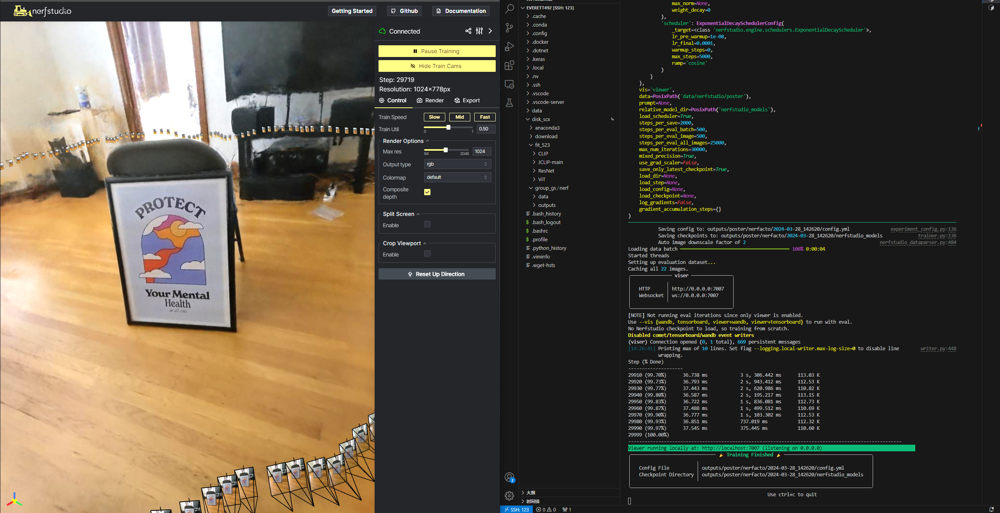
2. Use pretrained model:
    - Load:

        ```text
        ns-train nerfacto --data data/nerfstudio/poster --load-dir {outputs/.../nerfstudio_models}
        ```

    - Visualize existing run:

        ```text
        ns-viewer --load-config {outputs/.../config.yml}
        ```

3. Export results
    - Rendering vedio:
        - Add camera --> Generate command --> input --> success
        - When testing in environment `nerfstudio`, problem occurred: `Could not find ffmpeg. Please install ffmpeg`. Using `pip install ffmpeg` didn't work. Use `sudo apt install ffmpeg` instead.
    - Point cloud: `ply` file
    - Mesh: `obj` file

## NeRF: Neural Radiance Field

### Original NeRF

1. Original paper: [NeRF: Representing Scenes as Neural Radiance Fields for View Synthesis](https://arxiv.org/pdf/2003.08934.pdf)
    - Inrtroduction:
        - A static scene is represented by a continuous `5D funtion` that outputs the `radiance` emitted in each direction (θ, φ) at each point (x, y, z) in space, and a `density` at each point which acts like a differential opacity controlling how much radiance is accumulated bt a ray passing through (x, y, z).
        - The 5D funtion is represented by an MLP.
        - Rendering step:
            - March camera rays through the scene to generate a sampled set of 3D points.
            - Use those points and their corresponding 2D viewing directions as input to the NN to produce an output set of colors and densities.
            - Use classical volume rendering techniques to accumulate those colors and densities into a 2D image.

            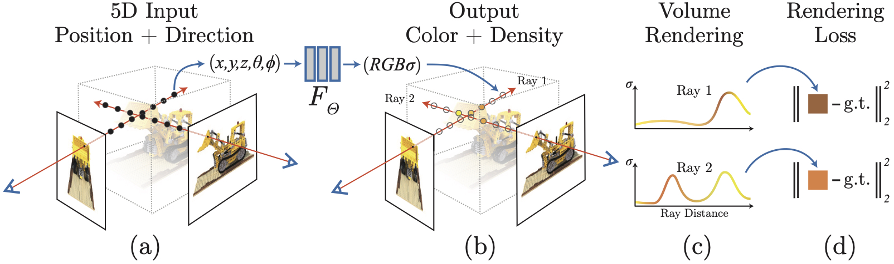

        - Disadvantages of basic implementation:
            - low resolution, inefficient
            - solution 1: positional encoding
            - solution 2: hierarchical sampling
    - Neural Radiance Field Scence Representation
        - The 5D vector-valued function:
            - Input: (x, y, z, θ, φ)
            - Output: (r, g, b, σ)
            - Approximate this function with an MPL network: `FΘ : (x, d) → (c, σ)`.
        - Density σ is predicted as a function of only the location x. Color c is predicted as a function of both location and viewing direction.
        - Network Architecture:
        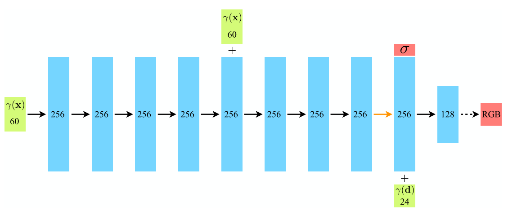
    - Volume Rendering with Radiance Fields
        - The 5D neural rediance field repersents a scence as the volume density and directional emitted radiance at any point in sapce.
        - The volume density σ(x) can be interpreted as the differential probability of a ray termination at an infinitesimal particle at location x.
        - The expected color C(r) of camera ray r(t) = o + td with near and far bounds tn and tf is:
        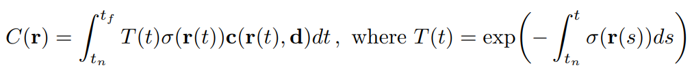
        - The function T(t) denotes accumulated transmittance along the ray from tn to t, the probability that the ray travels from tn to t without hitting any other particle.
        - Integral to Quadrature:
            - Stratified Sampling Approach: pertition [tn, tf] into N evenly-spaced bins and then dran one sample uniformly at random from within each bin
                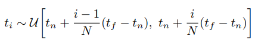
            - Use the samples above to estimate C(r):
                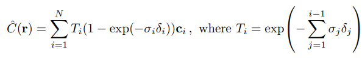
    - Optimizing a Neural Radiance Field
        - Positional encoding
            - The encoding function is applied separately to each of the three coordinate values in x and to the three components of the Cartesian viewing direction unit vector d.
            - For x, L = 10. For d, L = 4.
            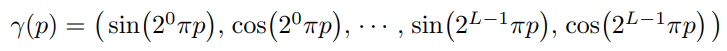
        - Hierarchical volume sampling
            - Two network is used to represent the scene: one "coarse" and one "fine".
            - First, use stratified sampling and evaluate the "coarse" nerwork at these locations.
            - Given the output of the "coarse" nerwork, produce a more informed sampling of points along each ray, where samples are biased towards the relebvant parts of the volume. To do this, first rewrite the alpha composited color from the coarse network as a weighted sum of all sampled colors along the way.

                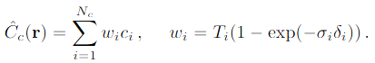

            - Normalizing these weights produces a piecewise-constant PDF along the ray. Then sample a second set from this distribution using inverse tranform sampling, evaluate the "fine" network at the union of the two sets of samples.
        - Implementation details
        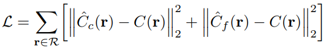
2. Camera parameters and coordinate system transformations
    - Reference: [Code Interpretation](https://zhuanlan.zhihu.com/p/593204605/)
    - Internal and external parameters of the camera:
        - External parameters:
            - Shape: a 4x4 matrix `M`, or world-to-camera matrix.
            - Useage: Transforms a point `P(world) = [x, y, z, 1]` in the world coordinate system to a point `P(camera) = MP(world)` in the camera coordinate system.
            - `M^(-1)`: c2w matrix:

            ```text
                       [r11, r12, r13, t1]
            [ R  T ] = [r21, r22, r23, t2]
            [ 0  1 ]   [r32, r32, r33, t3]
                       [  0,   0,   0,  1]
            ```

        - Internal parameters:
            - Usage: mapping 3D coordinates in the camera's coordinate system to the 2D image plane.
            - Take pinhhole camera as an example:

            ```text
                [fx,  0, cx]
            K = [ 0, fy, cy]
                [ 0,  0,  1]

            `fx` and `fy` are the horizontal and vertical focal lengths of the camera.
            `cx` and `cy` are the horizontal and vertical offsets of the image origin relative to the camera's center.
            ```

            ```python
            # Code constructing K in run_nerf.py
            if K is None:
                K = np.array([
                    [focal, 0, 0.5*W],
                    [0, focal, 0.5*H],
                    [0, 0, 1]
                ])
            ```

            - Abtaining camera parameters:
                - Synthesized data
                - Real data use COLMAP and [img2poses.py](https://github.com/Fyusion/LLFF/blob/master/imgs2poses.py) by NeRF's author.
                - `pose_bounds.npy`: `load_llff.py` will read the `poses_bounds.npy` file directly to get the camera parameters. `poses_bounds.npy` is an `Nx17` matrix, where N is the number of images. There are 17 parameters per image. The first 15 of these parameters can be rearranged into a 3x5 matrix form `[R T [H W f].transpose()]`. The last two parameters, `near` and `far` are used to represent to bounds of the scene.
        - Construcing 3D space ray:
            - A ray consists of a starting point and a direction, the starting point being the center of the camera. The location of pixel points in the imaging plane is also needed.
            - The NeRF code constructs the ray in the camera coordinate system, and then transforms the ray to the world coordinate system using the camera-to-world (c2w) matrix.
            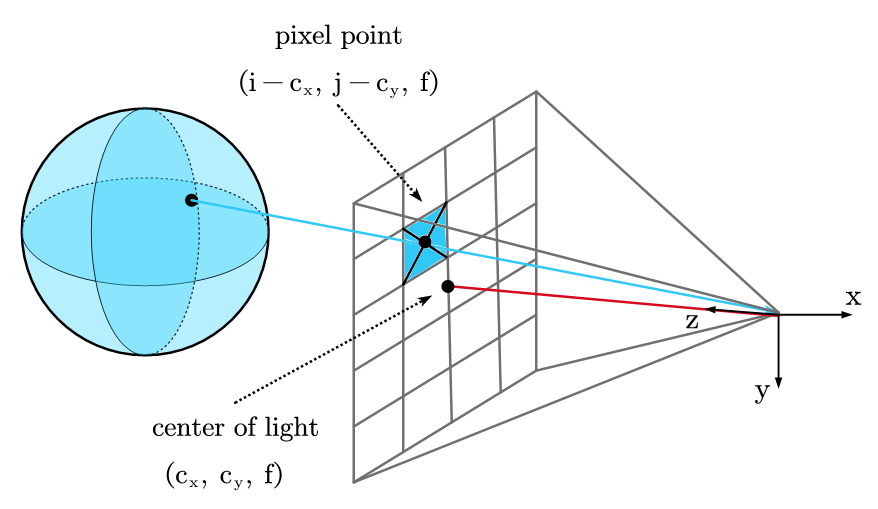
            - Code in NeRF:

                ```python
                def get_rays_np(H, W, K, c2w):
                    i, j = np.meshgrid(np.arange(W, dtype=np.float32), np.arange(H, dtype=np.float32), indexing='xy')
                    dirs = np.stack([(i-K[0][2])/K[0][0], -(j-K[1][2])/K[1][1], -np.ones_like(i)], -1)
                    # Rotate ray directions from camera frame to the world frame
                    rays_d = np.sum(dirs[..., np.newaxis, :] * c2w[:3,:3], -1)  # dot product, equals to: [c2w.dot(dir) for dir in dirs]
                    # Translate camera frame's origin to the world frame. It is the origin of all rays.
                    rays_o = np.broadcast_to(c2w[:3,-1], np.shape(rays_d))
                    return rays_o, rays_d
                ```

3. Model components of nerfstudio: [model_components](https://github.com/nerfstudio-project/nerfstudio/blob/main/nerfstudio/model_components), [official document](https://docs.nerf.studio/nerfology/model_components)
    - Camera Models:
        - Perspective camera model
        - Fisheye camera model
        - Equirectangular/spherical camera model
        - Distortion parameters: modeling the distortion caused by the lenses may be benificial.
    - Sample Representation
    - Ray Samplers: decide how to place the samples along a ray.
        - Stratified sampling
        - Spaced samplers
        - PDF(probability distribution function) samplers
    - Spatial Distortions
    - Field Encoders
        - NeRF positional encoding
        - Random fourier feature encoding
        - Hash encoding
        - Spherical harmonic encoding
4. Basic model by nerfstudio: [basic_model.py](https://github.com/nerfstudio-project/nerfstudio/blob/main/nerfstudio/models/base_model.py)
    - `class ModelConfig`: model configuration.
    - `class Model`: model defination
        - `__init__(self, config, scene_box, num_train_data, **kwards)`
        - `device(self)`: return the device the model is on.
        - `get_training_callbacks(self)`: returns a list of callbacks that run functions at the specified training iterations.
        - `populate_modules(self)`: set the necessary optional modules that are common among many networks.
        - `@abstractmethod get_param_groups(self) -> Dict[str, List[Parameter]]`: obtain the parameter groups for optimizers.
        - `@abstractmethod get_outputs(self, raybundle: Union[RayBundle, Cameras]) -> Dict[str, Union[torch.Tensor, List]]`: takes in a Ray Bundle and returns a dictionary of outputs.
        - `forward(self, ray_bundle: Union[RayBundle, Cameras]) -> Dict[str, Union[torch.Tensor, List]]`: run foward starting with a ray bundle. This outputs different things depending on the configuration of the model and whether or not the batch is provided (whether or not we are training basically).
        - `get_metrics_dict(self, outputs, batch) -> Dict[str, torch.Tensor]`: compute and return metrics. `outputs` is the output to compute loss dict to and `batch` is the ground truth batch corresponding to `outputs`.
        - `@abstractmethod get_loss_dict(self, outputs, batch, metrics_dict=None) -> Dict[str, torch.Tensor]`: compute and returns the losses dict. `metrics_dict` is the dictionary of metrics, some of which can be used for loss.
        - `@torch.no_grad get_outputs_for_camera(self, camera: Cameras, obb_box: Optional[OrientedBox] = None) -> Dict[str, torch.Tensor]`: takes in a camera, generates the raybundle, and compute the output of the model.
        - `@torch.no_grad() get_outputs_for_camera_ray_bundle(self, camera_ray_bundle: RayBundle) -> Dict[str, torch.Tensor]`: takes in camera parameters and compute the output of the model.
        - `get_rgba_image(self, outputs: Dict[str, torch.Tensor], output_name: str = "rgb") -> torch.Tensor`: return the RGBA image from the outputs of the model.
        - `@abstractmethod get_image_metrics_and_images(self, outputs: Dict[str, torch.Tensor], batch: Dict[str, torch.Tensor]) -> Tuple[Dict[str, float], Dict[str, torch.Tensor]]`: writes the test image outputs.
        - `load_model(self, loaded_state: Dict[str, Any]) -> None`: load the checkpoint from the given path.
        - `update_to_step(self, setp: int) -> None`: called when loading a model from a checkpoint. Sets any model parameters that change over training to the correct value, based on the training step of the checkpoint.
5. Code of [NeRFField](https://github.com/nerfstudio-project/nerfstudio/blob/main/nerfstudio/fields/vanilla_nerf_field.py)
    - Structure:

        ```text
        vanilla_nerf_field.py
         |___ class NeRFField
               |___ func __init__
               |___ func get_density
               |___ func get_outputs
        ```

    - `__init__`:

        ```python
        def __init__(
            self,
            position_encoding: Encoding = Identity(in_dim=3),
            direction_encoding: Encoding = Identity(in_dim=3),
            base_mlp_num_layers: int = 8,
            base_mlp_layer_width: int = 256,
            head_mlp_num_layers: int = 2,
            head_mlp_layer_width: int = 128,
            skip_connections: Tuple[int] = (4,),
            field_heads: Optional[Tuple[Type[FieldHead]]] = (RGBFieldHead,),
            use_intergrated_encoding: bool = False,
            spatial_distortion: Optional[SpatialDistortion] = None,
        ) -> None:
            super.__init__()
            self.position_encoding = position_encoding
            self.direction_encoding = direction_encoding
            self.use_integrated_encoding = use_integrated_encoding
            self.spatial_distortion = spatial_distortion

            self.mlp_base = MLP(
                in_dim=self.position_encoding.get_out_dim(),
                num_layers=base_mlp_num_layers,
                layer_width=base_mlp_layer_width,
                skip_connections=skip_connections,
                out_activation=nn.ReLU(),
            )
            self.field_output_density = DensityFieldHead(in_dim=self.mlp_base.get_out_dim())

            if field_heads:
                self.mlp_head = MLP(
                    in_dim=self.mlp_base.get_out_dim() + self.direction_encoding.get_out_dim(),
                    num_layers=head_mlp_num_layers,
                    layer_width=head_mlp_layer_width,
                    out_activation=nn.ReLU(),
                )
            self.field_heads = nn.ModuleList([field_head() for field_head in field_heads] if field_heads else [])  # type: ignore
            for field_head in self.field_heads:
                field_head.set_in_dim(self.mlp_head.get_out_dim())  # type: ignore
        ```

    - `get_density`:
    - `get_outputs`:
6. `NeRF` by nerfstudio:
    - Goal: optimize a volumetric repersentation of a scene that can be rendered from novel viewpoints. This representation is optimized from a set of images and associated camera poses.
    - Pipeline:

        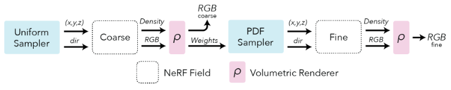

        - Field repersentation: For each point in space, the NeRF represents a view dependent radiance. Each point has a density and a view dependent color that cahnges depending on the angle the point is viewed.

            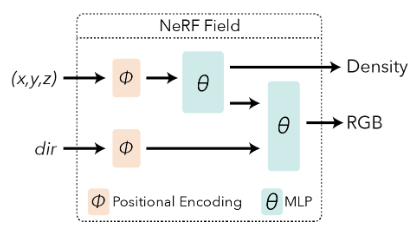

        - Positional encoding

            ```python
            from nerfstudio.field_components.encodings import NeRFEncoding

            pos_enc = NeRFEncoding(in_dim=3, num_frequencies=10, min_freq_exp=0.0, max_freq_exp=8.0, include_input=True)
            dis_enc = NeRFEncoding(in_dim=3, num_frequencies=4, min_freq_exp=0.0, max_freq_exp=8.0, include_input=True)
            ```

        - Rendering: To render an image of the space, we are going to project a ray from the target pixel and evaluate points along the ray relying on classic volumetric rendering techniques to conposite the points into a predicted color.

            ```python
            from nerfstudio.model_components.renderers import RGBRenderer

            renderer_rgb = RGBRenderer(background_color=colors.WHITE)
            field_outputs = field_coarse.foward(ray_samples)
            weights = ray_samples.get_weights(field_outputs[FieldHeadNames.DENSITY])
            rgb = renderer_rgb(rgb=field_outputs[FieldHeadNames.RGB], weights=weights)
            ```

        - Sampling: In NeRF we take advantage of a hierarchical sampling scheme that first uses a uniform sampler and is followed by a PDF sampler.

            ```python
            from nerfstudio.model_components.ray_samplers import PDFSampler, UniformSampler

            sampler_uniform = UniformSampler(num_samples=num_coarse_samples)
            ray_samples_uniform = sampler_uniform(ray_bundle)

            sampler_pdf = PDFSampler(num_samples=num_importance_samples)
            field_outputs_coarse = field_coarse.forward(ray_samples_uniform)
            weights_coarse = ray_samples_uniform.get_weights(field_outputs_coarse[FieldHeadNames.DENSITY])
            ray_samples_pdf = sampler_pdf(ray_bundle, ray_samples_uniform, weights_coarse)
            ```

    - Code: [vanilla_nerf.py](https://github.com/nerfstudio-project/nerfstudio/blob/main/nerfstudio/models/vanilla_nerf.py)
        - Strcuture:

            ```text
            vanilla_nerf.py
             |___ class VanillaModelConfig
             |___ class NeRFModel
                   |___ func __init__
                   |___ func populate_modules
                   |___ func get_param_groups
                   |___ func get_outputs
                   |___ func get_loss_dict
                   |___ func get_image_metrics_and_image
            ```

        - `class NeRFModel(Model)`: subclass of basic model `Model`
            - `__init__(self, config, **kwargs,) -> None`: set configures.
            - `populate_modules(self)`:set the fields and modules. Including `position_encoding(NeRFEncoding)`, `direction_encoding(NeRFEncoding)`, `self.field_coarse`, `self.field_fine`, `self.sampler_uniform`, `self.sampler_pdf`, `self.renderer_rgb`, `self.renderer_accumulation`, `self.renderer_depth`, `self.loss`, etc.
            - `get_param_groups(self) -> Dict[str, List[Parameter]]`:

                ```python
                def get_param_groups(self) -> Dict[str, List[Parameter]]:
                    param_groups = {}
                    if self.field_coarse is None or self.field_fine is None:
                        raise ValueError("populate_fields() must be called before get_param_groups")
                    param_groups["fields"] = list(self.field_coarse.parameters()) + list(self.field_fine.parameters())
                    if self.temporal_distortion is not None:
                        param_groups["temporal_distortion"] = list(self.temporal_distortion.parameters())
                    return param_groups
                ```

            - `get_outputs(self, ray_bundle: RayBundle)`: take in a `RayBundle` and output a dictionary after passing through uniform sampling, coarse fields, PDF sampling and fine field. Here's the output dictionary.

                ```python
                outputs = {
                    "rgb_coarse": rgb_coarse,
                    "rgb_fine": rgb_fine,
                    "accumulation_coarse": accumulation_coarse,
                    "accumulation_fine": accumulation_fine,
                    "depth_coarse": depth_coarse,
                    "depth_fine": depth_fine,
                }
                ```

            - `get_loss_dict(self, outputs, batch, metrics_dict=None) -> Dict[str, torch.Tensor]`: get the dictionary of losses, including `rgb_loss_coarse`, `rgb_loss_fine`.

                ```python
                def get_loss_dict(self, outputs, batch, metrics_dict=None) -> Dict[str, torch.Tensor]:
                    # Scaling metrics by coefficients to create the losses.
                    device = outputs["rgb_coarse"].device
                    image = batch["image"].to(device)
                    coarse_pred, coarse_image = self.renderer_rgb.blend_background_for_loss_computation(
                        pred_image=outputs["rgb_coarse"],
                        pred_accumulation=outputs["accumulation_coarse"],
                        gt_image=image,
                    )
                    fine_pred, fine_image = self.renderer_rgb.blend_background_for_loss_computation(
                        pred_image=outputs["rgb_fine"],
                        pred_accumulation=outputs["accumulation_fine"],
                        gt_image=image,
                    )

                    rgb_loss_coarse = self.rgb_loss(coarse_image, coarse_pred)
                    rgb_loss_fine = self.rgb_loss(fine_image, fine_pred)

                    loss_dict = {"rgb_loss_coarse": rgb_loss_coarse, "rgb_loss_fine": rgb_loss_fine}
                    loss_dict = misc.scale_dict(loss_dict, self.config.loss_coefficients)
                    return loss_dict
                ```

            - `get_image_metrics_and_images(self, outputs: Dict[str, torch.Tensor], batch: Dict[str, torch.Tensor]) -> Tuple[Dict[str, float], Dict[str, torch.Tensor]]`:
7. Other reference: [NeRF_PyTorch](https://github.com/yenchenlin/nerf-pytorch)

### NeRFactor

1. Pipeline:

    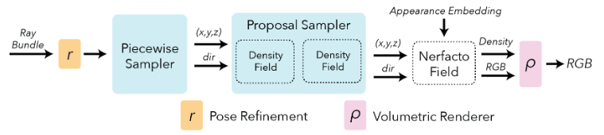

    - Pose refinement: It is uncommon to have errors in the predicted camera poses (camera poses are generated from images, which may cause loss). The NeRF framework allows to backpropagaet loss gradients to the input pose calculations. The information can be used to optimize and refine the poses.
    - Piecewise sampler: Allocating half of the samples uniformly up to a dsitance of 1 from the camera. The remaining samples aer distibuted such that the step size increases with each sample, which allows to sample distant objects while still having a dense set of samples for near objects.
    - Proposal sampler:
        - The proposal sampler consolidates the sample loactions to the regions of the scene that contribute most to the final render (typically the first surface intersection).
        - A density function for the scene is needed. The function can be implemented in many ways, such as using a small fused-mlp with a hash encoding, which has sufficient accuracy and is fas.
        - The proposal network sampler can be chained together with multiple density functions to further consolidate the sampling.
        - Two density functions is better than one. Larger than 2 leads to diminishing returns.
    - Density field
    - Nerfacto field

        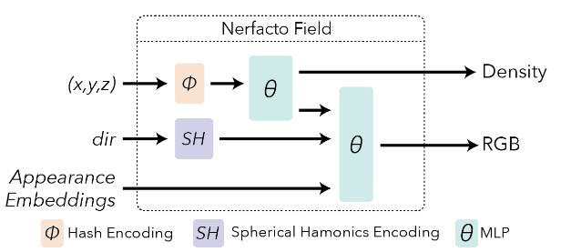

2. Code of [nerfacto_field.py](https://github.com/nerfstudio-project/nerfstudio/blob/main/nerfstudio/fields/nerfacto_field.py)
    - Structure:

        ```text
        nerfacto_field.py
         |___ class NerfctoField
               |___ func __init__
               |___ func get_density
               |___ func get_outputs
        ```

    - `__init__()`: Important variables: `self.dirction_encoding(SHEncoding)`, `self.position_encoding(NeRFEncoding)`, `self.mlp_base`, `self.embedding_appearance`, etc.
    - `get_density(self, ray_samples: RaySamples) -> Tuple[Tensor, Tensor]`: Computes and returns the densities.
    - `get_outputs(self, ray_samples: RaySamples, density_embedding: Optional[Tensor] = None) -> Dict[FieldHeadNames, Tensor]`
3. Code of [nerfacto.py](https://github.com/nerfstudio-project/nerfstudio/blob/main/nerfstudio/models/nerfacto.py)
    - Strcuture:

        ```text
        nerfacto.py
         |___ class NerfactoModelConfig
         |___ class NerfactoModel
               |___ func populate_modules
               |    |___ func update_schedule
               |___ func get_param_groups
               |___ func get_training_callbacks
               |    |___ func set_anneal
               |         |___ func bias
               |___ func get_outputs
               |___ func get_metrics_dict
               |___ func get_loss_dict
               |___ func get_image_metrics_and_image
        ```

    - `class Nerfacto(Model)`: subclass of basic model `Model`
        - `populate_modules(self)`: set the fields and modules, including `self.config`, `self.field`, `self.camera_optimizer`, `self.density_fns`, `self.proposal_nerworks`, `self.proposal_sampler`, `self.collider`, `self.renderer_rgb`, `self.renderer_accumulation`, `self.renderer_depth`, `self.renderer_expected_depth`, `self.renderer_normals`, `self.normals_shader`, `self.rgb_loss`, etc.
        - `get_param_groups(self) -> Dict[str, List[Parameter]]`:

            ```python
            def get_param_groups(self) -> Dict[str, List[Parameter]]:
                """Obtain the parameter groups for optimizers."""
                param_groups = {}
                param_groups["proposal_networks"] = list(self.proposal_networks.parameters())
                param_groups["fields"] = list(self.field.paramters())
                return param_groups
            ```

        - `get_training_callbacks(self, training_callback_attributes: TrainingCallbackAttributes) -> List[TrainingCallback]`: Returns a list of callbacks that run functions at the specified training iterations.
        - `get_outputs(self, ray_bundle: RayBundle)`

            ```python
            def get_outputs(self, ray_bundle: RayBundle):
                # apply the camera optimizer pose tweaks
                if self.training:
                    self.camera_optimizer.apply_to_raybundle(ray_bundle)
                ray_samples: RaySamples
                ray_samples, weights_list, ray_samples_list = self.proposal_sampler(ray_bundle, density_fns=self.density_fns)
                field_outputs = self.field.forward(ray_samples, compute_normals=self.config.predict_cormals)
                if self.config.use_gradient_scaling:
                    field_outputs = scale_gradients_by_distance_squared(field_outputs, ray_samples)

                weights = ray_samples.get_weights(field_outputs[FieldHeadNames.DENSITY])
                weights_list.append(weights)
                ray_samples_list.append(ray_samples)

                rgb = self.renderer_rgb(rgb=field_outputs[FieldHeadNAmes.RGB], weights=weights)
                with torch.no_grad():
                    depth = self.renderer_depth(weights=weights, ray_samples=ray_samples)
                expected_depth = self.renderer_expected_depth(weights=weights, ray_samples=ray_samples)
                accumulation = self.renderer_accumulation(weights=weights)

                outputs = {
                    "rgb": rgb,
                    "accumulation": accumulation,
                    "depth": depth,
                    "expected_depth": expected_depth,
                }

                if self.config.predict_normals:
                    normals = self.renderer_normals(normals=field_outputs[FieldHeadNames.NORMALS], weights=weights)
                    pred_normals = self.renderer_normals(field_outputs[FieldHeadName.PRED_NORMALS], weights=weights)
                    outputs["normals"] = self.normals_shader(normals)
                    outputs["pred_normals"] = self.normals_shader(pred_normals)

                if self.training:
                    outputs["weights_list"] = weight_list
                    outputs["weights_list"] = ray_samples_list

                if self.training and self.config.predict_normals:
                    outputs["rendered_orientation_loss"] = orientatin_loss(weights.detach(), field_outputs[FieldHeadNames.NORMALS], ray_bundle.directions)
                    outputs["rendered_pred_normal_loss"] = pred_normal_loss(weights.detach(), field_outputs[FieldHeadNames.NORMALS].detach(),field_outputs[FieldHeadNames.PRED_NORMALS])

                for i in range(self.config.num_proposal_iterations):
                    outputs[f"prop_depth_{i}"] = self.renderer_depth(weights=weights_list[i], ray_samples=ray_samples_list[i])
                return outputs
            ```

        - `get_metrics_dict(self, outputs, batch)`
        - `get_loss_dict(self, outputs, batch, metrics_dict=None)`: get the dictionary of losses, including `rgb_loss`, `interlevel_loss`, `distortion_loss`.

            ```python
            def get_loss_dict(self, outputs, batch, metrics_dict=None):
                loss_dict = {}
                image = batch["image"].to(self.decive)
                pred_rgb, gt_rgb = self.renderer_rgb.blend_background_for_loss_computation(pred_image=outputs["rgb"], pred_accumulation=outputs["accumulation"], ge_image=image)

                loss_dict["rgb_loss"] = self.rgb_loss(gt_rgb, pred_rgb)
                if self.training:
                    loss_dict["interlevel_loss"] = self.config.interlevel_loss_mult * interlevel_loss(outputs["weights_list"], outputsp["ray_sample_list"])
                    assert metrics_dict is not None and "distortion" in metrics_dict
                    loss_dict["distortion_loss"] = self.config.distortion_loss_mult * metrics_dict["distortion"]
                    if self.config.predict_normals:
                        # orientation loss for computed normals
                        loss_dict["orientation_loss"] = self.config.orientation_loss_mult * torch.mean(outputs["rendered_orientation_loss"])

                        # ground truth supervision for normals
                        loss_dict["pred_normal_loss"] = self.config.pred_normal_loss_mult * torch.mean(outputs["rendered_pred_normal_loss"])
                    
                    # Add loss from camera optimizer
                    self.camera_optimizer.get_loss_dict(loss_dict)
                return loss_dict
            ```

        - `get_image_metrics_and_images(self, outputs: Dict[str, torch.Tensor], batch: Dict[str, torch.Tensor]) -> Tuple[Dict[str, float], Dict[str, torch.Tensor]]`
