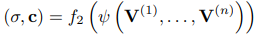
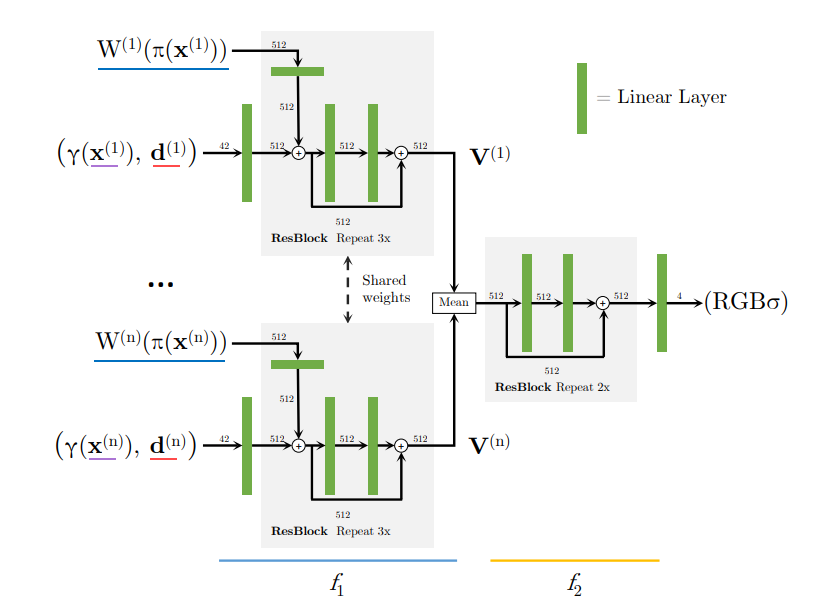
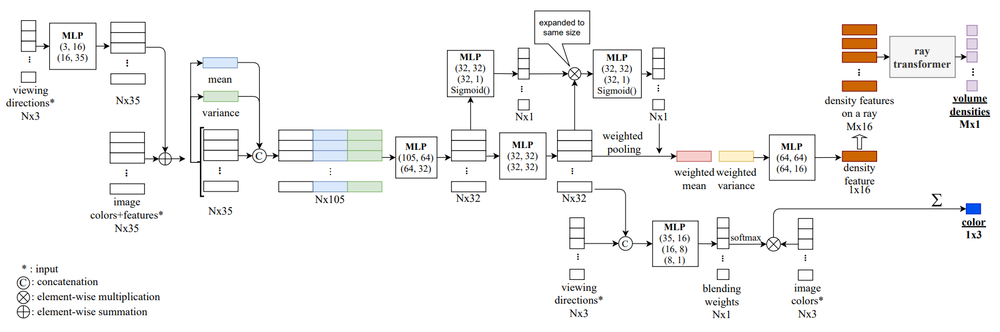

<!-- markdownlint-disable MD024 -->
# Working Log in Group_GS

## Webs Used

1. [nerfstudio official document](https://docs.nerf.studio/)

## Nerfstudio Start

### Installation

[Installation Instruction](https://docs.nerf.studio/quickstart/installation.html)

1. Create environment:

    ```text
    conda create --name nerfstudio -y python=3.8
    conda activate nerfstudio
    pyhton -m pip install --upgrade pip
    ```

2. Dependencies:
    - PyTorch
        - PyTorch
        - Build necessary CUDA extensions.

            ```text
            conda install -c "nvidia/label/cuda-11.8.0" cuda-toolkit
            ```

    - tiny-cuda-nn

        ```text
        pip install ninja git+https://github.com/NVlabs/tiny-cuda-nn/#subdirectory=bindings/torch
        ```

3. Installing nerfstudio

    ```text
    pip install nerfstudio
    ```

### Run First Model

[Training Your First Model](https://docs.nerf.studio/quickstart/first_nerf.html)

1. Train and run viewer:
    - Test dataset downloading: original order `ns-download-data nerfstudio --capture-name=poster` is not effective. I've uploaded the dataset to my cloud drive. Click [here](https://cloud.tsinghua.edu.cn/f/25b61d6d5e02483eb1fc/?dl=1) to download.
    - Train model: `ns-train nerfacto --data data/nerfstudio/poster`
    
2. Use pretrained model:
    - Load:

        ```text
        ns-train nerfacto --data data/nerfstudio/poster --load-dir {outputs/.../nerfstudio_models}
        ```

    - Visualize existing run:

        ```text
        ns-viewer --load-config {outputs/.../config.yml}
        ```

3. Export results
    - Rendering vedio:
        - Add camera --> Generate command --> input --> success
        - When testing in environment `nerfstudio`, problem occurred: `Could not find ffmpeg. Please install ffmpeg`. Using `pip install ffmpeg` didn't work. Use `sudo apt install ffmpeg` instead.
    - Point cloud: `ply` file
    - Mesh: `obj` file

## NeRF: Neural Radiance Field

### Original NeRF

1. Original paper: [NeRF: Representing Scenes as Neural Radiance Fields for View Synthesis](https://arxiv.org/pdf/2003.08934.pdf)
    - Inrtroduction:
        - A static scene is represented by a continuous `5D function` that outputs the `radiance` emitted in each direction (θ, φ) at each point (x, y, z) in space, and a `density` at each point which acts like a differential opacity controlling how much radiance is accumulated by a ray passing through (x, y, z).
        - The 5D funtion is represented by an MLP.
        - Rendering step:
            - March camera rays through the scene to generate a sampled set of 3D points.
            - Use those points and their corresponding 2D viewing directions as input to the NN to produce an output set of colors and densities.
            - Use classical volume rendering techniques to accumulate those colors and densities into a 2D image.

            

        - Disadvantages of basic implementation:
            - low resolution, inefficient
            - solution 1: positional encoding
            - solution 2: hierarchical sampling
    - Neural Radiance Field Scence Representation
        - The 5D vector-valued function:
            - Input: (x, y, z, θ, φ)
            - Output: (r, g, b, σ)
            - Approximate this function with an MPL network: `FΘ : (x, d) → (c, σ)`.
        - Density σ is predicted as a function of only the location x. Color c is predicted as a function of both location and viewing direction.
        - Network Architecture:
        
    - Volume Rendering with Radiance Fields
        - The 5D neural rediance field repersents a scence as the volume density and directional emitted radiance at any point in sapce.
        - The volume density σ(x) can be interpreted as the differential probability of a ray termination at an infinitesimal particle at location x.
        - The expected color C(r) of camera ray r(t) = o + td with near and far bounds tn and tf is:
        
        - The function T(t) denotes accumulated transmittance along the ray from tn to t, the probability that the ray travels from tn to t without hitting any other particle.
        - Integral to Quadrature:
            - Stratified Sampling Approach: pertition [tn, tf] into N evenly-spaced bins and then dran one sample uniformly at random from within each bin
                
            - Use the samples above to estimate C(r):
                
    - Optimizing a Neural Radiance Field
        - Positional encoding
            - The encoding function is applied separately to each of the three coordinate values in x and to the three components of the Cartesian viewing direction unit vector d.
            - For x, L = 10. For d, L = 4.
            
        - Hierarchical volume sampling
            - Two network is used to represent the scene: one "coarse" and one "fine".
            - First, use stratified sampling and evaluate the "coarse" nerwork at these locations.
            - Given the output of the "coarse" nerwork, produce a more informed sampling of points along each ray, where samples are biased towards the relebvant parts of the volume. To do this, first rewrite the alpha composited color from the coarse network as a weighted sum of all sampled colors along the way.

                

            - Normalizing these weights produces a piecewise-constant PDF along the ray. Then sample a second set from this distribution using inverse tranform sampling, evaluate the "fine" network at the union of the two sets of samples.
        - Implementation details
        
2. Camera parameters and coordinate system transformations
    - Reference: [Code Interpretation](https://zhuanlan.zhihu.com/p/593204605/)
    - Internal and external parameters of the camera:
        - External parameters:
            - Shape: a 4x4 matrix `M`, or world-to-camera matrix.
            - Useage: Transforms a point `P(world) = [x, y, z, 1]` in the world coordinate system to a point `P(camera) = MP(world)` in the camera coordinate system.
            - `M^(-1)`: c2w matrix:

            ```text
                       [r11, r12, r13, t1]
            [ R  T ] = [r21, r22, r23, t2]
            [ 0  1 ]   [r32, r32, r33, t3]
                       [  0,   0,   0,  1]
            ```

        - Internal parameters:
            - Usage: mapping 3D coordinates in the camera's coordinate system to the 2D image plane.
            - Take pinhhole camera as an example:

            ```text
                [fx,  0, cx]
            K = [ 0, fy, cy]
                [ 0,  0,  1]

            `fx` and `fy` are the horizontal and vertical focal lengths of the camera.
            `cx` and `cy` are the horizontal and vertical offsets of the image origin relative to the camera's light center.
            ```

            ```python
            # Code constructing K in run_nerf.py
            if K is None:
                K = np.array([
                    [focal, 0, 0.5*W],
                    [0, focal, 0.5*H],
                    [0, 0, 1]
                ])
            ```

            - Abtaining camera parameters:
                - Synthesized data
                - Real data use COLMAP and [img2poses.py](https://github.com/Fyusion/LLFF/blob/master/imgs2poses.py) by NeRF's author.
                - `pose_bounds.npy`: `load_llff.py` will read the `poses_bounds.npy` file directly to get the camera parameters. `poses_bounds.npy` is an `Nx17` matrix, where N is the number of images. There are 17 parameters per image. The first 15 of these parameters can be rearranged into a 3x5 matrix form `[R T [H W f].transpose()]`. The last two parameters, `near` and `far` are used to represent to bounds of the scene.
        - Construcing 3D space ray:
            - A ray consists of a starting point and a direction, the starting point being the center of the camera. The location of pixel points in the imaging plane is also needed.
            - The NeRF code constructs the ray in the camera coordinate system, and then transforms the ray to the world coordinate system using the camera-to-world (c2w) matrix.
            
            - Code in NeRF:

                ```python
                def get_rays_np(H, W, K, c2w):
                    i, j = np.meshgrid(np.arange(W, dtype=np.float32), np.arange(H, dtype=np.float32), indexing='xy')
                    dirs = np.stack([(i-K[0][2])/K[0][0], -(j-K[1][2])/K[1][1], -np.ones_like(i)], -1)
                    # Rotate ray directions from camera frame to the world frame
                    rays_d = np.sum(dirs[..., np.newaxis, :] * c2w[:3,:3], -1)  # dot product, equals to: [c2w.dot(dir) for dir in dirs]
                    # Translate camera frame's origin to the world frame. It is the origin of all rays.
                    rays_o = np.broadcast_to(c2w[:3,-1], np.shape(rays_d))
                    return rays_o, rays_d
                ```

3. Model components of nerfstudio: [model_components](https://github.com/nerfstudio-project/nerfstudio/blob/main/nerfstudio/model_components), [official document](https://docs.nerf.studio/nerfology/model_components)
    - Camera Models:
        - Perspective camera model
        - Fisheye camera model
        - Equirectangular/spherical camera model
        - Distortion parameters: modeling the distortion caused by the lenses may be benificial.
    - Sample Representation
    - Ray Samplers: decide how to place the samples along a ray.
        - Stratified sampling
        - Spaced samplers
        - PDF(probability distribution function) samplers
    - Spatial Distortions
    - Field Encoders
        - NeRF positional encoding
        - Random fourier feature encoding
        - Hash encoding
        - Spherical harmonic encoding
4. Basic model by nerfstudio: [basic_model.py](https://github.com/nerfstudio-project/nerfstudio/blob/main/nerfstudio/models/base_model.py)
    - `class ModelConfig`: model configuration.
    - `class Model`: model defination
        - `__init__(self, config, scene_box, num_train_data, **kwards)`
        - `device(self)`: return the device the model is on.
        - `get_training_callbacks(self)`: returns a list of callbacks that run functions at the specified training iterations.
        - `populate_modules(self)`: set the necessary optional modules that are common among many networks.
        - `@abstractmethod get_param_groups(self) -> Dict[str, List[Parameter]]`: obtain the parameter groups for optimizers.
        - `@abstractmethod get_outputs(self, raybundle: Union[RayBundle, Cameras]) -> Dict[str, Union[torch.Tensor, List]]`: takes in a Ray Bundle and returns a dictionary of outputs.
        - `forward(self, ray_bundle: Union[RayBundle, Cameras]) -> Dict[str, Union[torch.Tensor, List]]`: run foward starting with a ray bundle. This outputs different things depending on the configuration of the model and whether or not the batch is provided (whether or not we are training basically).
        - `get_metrics_dict(self, outputs, batch) -> Dict[str, torch.Tensor]`: compute and return metrics. `outputs` is the output to compute loss dict to and `batch` is the ground truth batch corresponding to `outputs`.
        - `@abstractmethod get_loss_dict(self, outputs, batch, metrics_dict=None) -> Dict[str, torch.Tensor]`: compute and returns the losses dict. `metrics_dict` is the dictionary of metrics, some of which can be used for loss.
        - `@torch.no_grad get_outputs_for_camera(self, camera: Cameras, obb_box: Optional[OrientedBox] = None) -> Dict[str, torch.Tensor]`: takes in a camera, generates the raybundle, and compute the output of the model.
        - `@torch.no_grad() get_outputs_for_camera_ray_bundle(self, camera_ray_bundle: RayBundle) -> Dict[str, torch.Tensor]`: takes in camera parameters and compute the output of the model.
        - `get_rgba_image(self, outputs: Dict[str, torch.Tensor], output_name: str = "rgb") -> torch.Tensor`: return the RGBA image from the outputs of the model.
        - `@abstractmethod get_image_metrics_and_images(self, outputs: Dict[str, torch.Tensor], batch: Dict[str, torch.Tensor]) -> Tuple[Dict[str, float], Dict[str, torch.Tensor]]`: writes the test image outputs.
        - `load_model(self, loaded_state: Dict[str, Any]) -> None`: load the checkpoint from the given path.
        - `update_to_step(self, setp: int) -> None`: called when loading a model from a checkpoint. Sets any model parameters that change over training to the correct value, based on the training step of the checkpoint.
5. Code of [NeRFField](https://github.com/nerfstudio-project/nerfstudio/blob/main/nerfstudio/fields/vanilla_nerf_field.py)
    - Structure:

        ```text
        vanilla_nerf_field.py
         |___ class NeRFField
               |___ func __init__
               |___ func get_density
               |___ func get_outputs
        ```

    - `__init__`:

        ```python
        def __init__(
            self,
            position_encoding: Encoding = Identity(in_dim=3),
            direction_encoding: Encoding = Identity(in_dim=3),
            base_mlp_num_layers: int = 8,
            base_mlp_layer_width: int = 256,
            head_mlp_num_layers: int = 2,
            head_mlp_layer_width: int = 128,
            skip_connections: Tuple[int] = (4,),
            field_heads: Optional[Tuple[Type[FieldHead]]] = (RGBFieldHead,),
            use_intergrated_encoding: bool = False,
            spatial_distortion: Optional[SpatialDistortion] = None,
        ) -> None:
            super.__init__()
            self.position_encoding = position_encoding
            self.direction_encoding = direction_encoding
            self.use_integrated_encoding = use_integrated_encoding
            self.spatial_distortion = spatial_distortion

            self.mlp_base = MLP(
                in_dim=self.position_encoding.get_out_dim(),
                num_layers=base_mlp_num_layers,
                layer_width=base_mlp_layer_width,
                skip_connections=skip_connections,
                out_activation=nn.ReLU(),
            )
            self.field_output_density = DensityFieldHead(in_dim=self.mlp_base.get_out_dim())

            if field_heads:
                self.mlp_head = MLP(
                    in_dim=self.mlp_base.get_out_dim() + self.direction_encoding.get_out_dim(),
                    num_layers=head_mlp_num_layers,
                    layer_width=head_mlp_layer_width,
                    out_activation=nn.ReLU(),
                )
            self.field_heads = nn.ModuleList([field_head() for field_head in field_heads] if field_heads else [])  # type: ignore
            for field_head in self.field_heads:
                field_head.set_in_dim(self.mlp_head.get_out_dim())  # type: ignore
        ```

    - `get_density`:
    - `get_outputs`:
6. `NeRF` by nerfstudio:
    - Goal: optimize a volumetric repersentation of a scene that can be rendered from novel viewpoints. This representation is optimized from a set of images and associated camera poses.
    - Pipeline:

        

        - Field repersentation: For each point in space, the NeRF represents a view dependent radiance. Each point has a density and a view dependent color that cahnges depending on the angle the point is viewed.

            

        - Positional encoding

            ```python
            from nerfstudio.field_components.encodings import NeRFEncoding

            pos_enc = NeRFEncoding(in_dim=3, num_frequencies=10, min_freq_exp=0.0, max_freq_exp=8.0, include_input=True)
            dis_enc = NeRFEncoding(in_dim=3, num_frequencies=4, min_freq_exp=0.0, max_freq_exp=8.0, include_input=True)
            ```

        - Rendering: To render an image of the space, we are going to project a ray from the target pixel and evaluate points along the ray relying on classic volumetric rendering techniques to conposite the points into a predicted color.

            ```python
            from nerfstudio.model_components.renderers import RGBRenderer

            renderer_rgb = RGBRenderer(background_color=colors.WHITE)
            field_outputs = field_coarse.foward(ray_samples)
            weights = ray_samples.get_weights(field_outputs[FieldHeadNames.DENSITY])
            rgb = renderer_rgb(rgb=field_outputs[FieldHeadNames.RGB], weights=weights)
            ```

        - Sampling: In NeRF we take advantage of a hierarchical sampling scheme that first uses a uniform sampler and is followed by a PDF sampler.

            ```python
            from nerfstudio.model_components.ray_samplers import PDFSampler, UniformSampler

            sampler_uniform = UniformSampler(num_samples=num_coarse_samples)
            ray_samples_uniform = sampler_uniform(ray_bundle)

            sampler_pdf = PDFSampler(num_samples=num_importance_samples)
            field_outputs_coarse = field_coarse.forward(ray_samples_uniform)
            weights_coarse = ray_samples_uniform.get_weights(field_outputs_coarse[FieldHeadNames.DENSITY])
            ray_samples_pdf = sampler_pdf(ray_bundle, ray_samples_uniform, weights_coarse)
            ```

    - Code: [vanilla_nerf.py](https://github.com/nerfstudio-project/nerfstudio/blob/main/nerfstudio/models/vanilla_nerf.py)
        - Strcuture:

            ```text
            vanilla_nerf.py
             |___ class VanillaModelConfig
             |___ class NeRFModel
                   |___ func __init__
                   |___ func populate_modules
                   |___ func get_param_groups
                   |___ func get_outputs
                   |___ func get_loss_dict
                   |___ func get_image_metrics_and_image
            ```

        - `class NeRFModel(Model)`: subclass of basic model `Model`
            - `__init__(self, config, **kwargs,) -> None`: set configures.
            - `populate_modules(self)`:set the fields and modules. Including `position_encoding(NeRFEncoding)`, `direction_encoding(NeRFEncoding)`, `self.field_coarse`, `self.field_fine`, `self.sampler_uniform`, `self.sampler_pdf`, `self.renderer_rgb`, `self.renderer_accumulation`, `self.renderer_depth`, `self.loss`, etc.
            - `get_param_groups(self) -> Dict[str, List[Parameter]]`:

                ```python
                def get_param_groups(self) -> Dict[str, List[Parameter]]:
                    param_groups = {}
                    if self.field_coarse is None or self.field_fine is None:
                        raise ValueError("populate_fields() must be called before get_param_groups")
                    param_groups["fields"] = list(self.field_coarse.parameters()) + list(self.field_fine.parameters())
                    if self.temporal_distortion is not None:
                        param_groups["temporal_distortion"] = list(self.temporal_distortion.parameters())
                    return param_groups
                ```

            - `get_outputs(self, ray_bundle: RayBundle)`: take in a `RayBundle` and output a dictionary after passing through uniform sampling, coarse fields, PDF sampling and fine field. Here's the output dictionary.

                ```python
                outputs = {
                    "rgb_coarse": rgb_coarse,
                    "rgb_fine": rgb_fine,
                    "accumulation_coarse": accumulation_coarse,
                    "accumulation_fine": accumulation_fine,
                    "depth_coarse": depth_coarse,
                    "depth_fine": depth_fine,
                }
                ```

            - `get_loss_dict(self, outputs, batch, metrics_dict=None) -> Dict[str, torch.Tensor]`: get the dictionary of losses, including `rgb_loss_coarse`, `rgb_loss_fine`.

                ```python
                def get_loss_dict(self, outputs, batch, metrics_dict=None) -> Dict[str, torch.Tensor]:
                    # Scaling metrics by coefficients to create the losses.
                    device = outputs["rgb_coarse"].device
                    image = batch["image"].to(device)
                    coarse_pred, coarse_image = self.renderer_rgb.blend_background_for_loss_computation(
                        pred_image=outputs["rgb_coarse"],
                        pred_accumulation=outputs["accumulation_coarse"],
                        gt_image=image,
                    )
                    fine_pred, fine_image = self.renderer_rgb.blend_background_for_loss_computation(
                        pred_image=outputs["rgb_fine"],
                        pred_accumulation=outputs["accumulation_fine"],
                        gt_image=image,
                    )

                    rgb_loss_coarse = self.rgb_loss(coarse_image, coarse_pred)
                    rgb_loss_fine = self.rgb_loss(fine_image, fine_pred)

                    loss_dict = {"rgb_loss_coarse": rgb_loss_coarse, "rgb_loss_fine": rgb_loss_fine}
                    loss_dict = misc.scale_dict(loss_dict, self.config.loss_coefficients)
                    return loss_dict
                ```

            - `get_image_metrics_and_images(self, outputs: Dict[str, torch.Tensor], batch: Dict[str, torch.Tensor]) -> Tuple[Dict[str, float], Dict[str, torch.Tensor]]`:
7. Other reference: [NeRF_PyTorch](https://github.com/yenchenlin/nerf-pytorch)

### NeRFacto

1. Pipeline:

    

    - Pose refinement: It is uncommon to have errors in the predicted camera poses (camera poses are generated from images, which may cause loss). The NeRF framework allows to backpropagaet loss gradients to the input pose calculations. The information can be used to optimize and refine the poses.
    - Piecewise sampler: Allocating half of the samples uniformly up to a dsitance of 1 from the camera. The remaining samples aer distibuted such that the step size increases with each sample, which allows to sample distant objects while still having a dense set of samples for near objects.

        

    - Proposal sampler:
        - The proposal sampler consolidates the sample loactions to the regions of the scene that contribute most to the final render (typically the first surface intersection).
        - A density function for the scene is needed. The function can be implemented in many ways, such as using a small fused-mlp with a hash encoding, which has sufficient accuracy and is fas.
        - The proposal network sampler can be chained together with multiple density functions to further consolidate the sampling.
        - Two density functions is better than one. Larger than 2 leads to diminishing returns.
    - Density field
    - Nerfacto field

        

2. Code of [nerfacto_field.py](https://github.com/nerfstudio-project/nerfstudio/blob/main/nerfstudio/fields/nerfacto_field.py)
    - Structure:

        ```text
        nerfacto_field.py
         |___ class NerfctoField
               |___ func __init__
               |___ func get_density
               |___ func get_outputs
        ```

    - `__init__()`: Important variables: `self.dirction_encoding(SHEncoding)`, `self.position_encoding(NeRFEncoding)`, `self.mlp_base`, `self.embedding_appearance`, etc.
    - `get_density(self, ray_samples: RaySamples) -> Tuple[Tensor, Tensor]`: Computes and returns the densities.
    - `get_outputs(self, ray_samples: RaySamples, density_embedding: Optional[Tensor] = None) -> Dict[FieldHeadNames, Tensor]`
3. Code of [nerfacto.py](https://github.com/nerfstudio-project/nerfstudio/blob/main/nerfstudio/models/nerfacto.py)
    - Strcuture:

        ```text
        nerfacto.py
         |___ class NerfactoModelConfig
         |___ class NerfactoModel
               |___ func populate_modules
               |    |___ func update_schedule
               |___ func get_param_groups
               |___ func get_training_callbacks
               |    |___ func set_anneal
               |         |___ func bias
               |___ func get_outputs
               |___ func get_metrics_dict
               |___ func get_loss_dict
               |___ func get_image_metrics_and_image
        ```

    - `class Nerfacto(Model)`: subclass of basic model `Model`
        - `populate_modules(self)`: set the fields and modules, including `self.config`, `self.field`, `self.camera_optimizer`, `self.density_fns`, `self.proposal_nerworks`, `self.proposal_sampler`, `self.collider`, `self.renderer_rgb`, `self.renderer_accumulation`, `self.renderer_depth`, `self.renderer_expected_depth`, `self.renderer_normals`, `self.normals_shader`, `self.rgb_loss`, etc.
        - `get_param_groups(self) -> Dict[str, List[Parameter]]`:

            ```python
            def get_param_groups(self) -> Dict[str, List[Parameter]]:
                """Obtain the parameter groups for optimizers."""
                param_groups = {}
                param_groups["proposal_networks"] = list(self.proposal_networks.parameters())
                param_groups["fields"] = list(self.field.paramters())
                return param_groups
            ```

        - `get_training_callbacks(self, training_callback_attributes: TrainingCallbackAttributes) -> List[TrainingCallback]`: Returns a list of callbacks that run functions at the specified training iterations.
        - `get_outputs(self, ray_bundle: RayBundle)`

            ```python
            def get_outputs(self, ray_bundle: RayBundle):
                # apply the camera optimizer pose tweaks
                if self.training:
                    self.camera_optimizer.apply_to_raybundle(ray_bundle)
                ray_samples: RaySamples
                ray_samples, weights_list, ray_samples_list = self.proposal_sampler(ray_bundle, density_fns=self.density_fns)
                field_outputs = self.field.forward(ray_samples, compute_normals=self.config.predict_cormals)
                if self.config.use_gradient_scaling:
                    field_outputs = scale_gradients_by_distance_squared(field_outputs, ray_samples)

                weights = ray_samples.get_weights(field_outputs[FieldHeadNames.DENSITY])
                weights_list.append(weights)
                ray_samples_list.append(ray_samples)

                rgb = self.renderer_rgb(rgb=field_outputs[FieldHeadNAmes.RGB], weights=weights)
                with torch.no_grad():
                    depth = self.renderer_depth(weights=weights, ray_samples=ray_samples)
                expected_depth = self.renderer_expected_depth(weights=weights, ray_samples=ray_samples)
                accumulation = self.renderer_accumulation(weights=weights)

                outputs = {
                    "rgb": rgb,
                    "accumulation": accumulation,
                    "depth": depth,
                    "expected_depth": expected_depth,
                }

                if self.config.predict_normals:
                    normals = self.renderer_normals(normals=field_outputs[FieldHeadNames.NORMALS], weights=weights)
                    pred_normals = self.renderer_normals(field_outputs[FieldHeadName.PRED_NORMALS], weights=weights)
                    outputs["normals"] = self.normals_shader(normals)
                    outputs["pred_normals"] = self.normals_shader(pred_normals)

                if self.training:
                    outputs["weights_list"] = weight_list
                    outputs["weights_list"] = ray_samples_list

                if self.training and self.config.predict_normals:
                    outputs["rendered_orientation_loss"] = orientatin_loss(weights.detach(), field_outputs[FieldHeadNames.NORMALS], ray_bundle.directions)
                    outputs["rendered_pred_normal_loss"] = pred_normal_loss(weights.detach(), field_outputs[FieldHeadNames.NORMALS].detach(),field_outputs[FieldHeadNames.PRED_NORMALS])

                for i in range(self.config.num_proposal_iterations):
                    outputs[f"prop_depth_{i}"] = self.renderer_depth(weights=weights_list[i], ray_samples=ray_samples_list[i])
                return outputs
            ```

        - `get_metrics_dict(self, outputs, batch)`
        - `get_loss_dict(self, outputs, batch, metrics_dict=None)`: get the dictionary of losses, including `rgb_loss`, `interlevel_loss`, `distortion_loss`.

            ```python
            def get_loss_dict(self, outputs, batch, metrics_dict=None):
                loss_dict = {}
                image = batch["image"].to(self.decive)
                pred_rgb, gt_rgb = self.renderer_rgb.blend_background_for_loss_computation(pred_image=outputs["rgb"], pred_accumulation=outputs["accumulation"], ge_image=image)

                loss_dict["rgb_loss"] = self.rgb_loss(gt_rgb, pred_rgb)
                if self.training:
                    loss_dict["interlevel_loss"] = self.config.interlevel_loss_mult * interlevel_loss(outputs["weights_list"], outputsp["ray_sample_list"])
                    assert metrics_dict is not None and "distortion" in metrics_dict
                    loss_dict["distortion_loss"] = self.config.distortion_loss_mult * metrics_dict["distortion"]
                    if self.config.predict_normals:
                        # orientation loss for computed normals
                        loss_dict["orientation_loss"] = self.config.orientation_loss_mult * torch.mean(outputs["rendered_orientation_loss"])

                        # ground truth supervision for normals
                        loss_dict["pred_normal_loss"] = self.config.pred_normal_loss_mult * torch.mean(outputs["rendered_pred_normal_loss"])
                    
                    # Add loss from camera optimizer
                    self.camera_optimizer.get_loss_dict(loss_dict)
                return loss_dict
            ```

        - `get_image_metrics_and_images(self, outputs: Dict[str, torch.Tensor], batch: Dict[str, torch.Tensor]) -> Tuple[Dict[str, float], Dict[str, torch.Tensor]]`

## Meeting 2

### Papers

1. [pixelNeRF: Neural Radiance Fields from One or Few Images](https://arxiv.org/pdf/2012.02190.pdf)
2. [IBRNet: Learning Multi-View Image-Based Rendering](https://arxiv.org/pdf/2102.13090.pdf)
3. [Scene Representation Transformer](https://arxiv.org/pdf/2111.13152.pdf)
4. [MVSNeRF: Fast Generalizable Radiance Field Reconstruction from Multi-View Stereo](https://arxiv.org/pdf/2103.15595.pdf)

### pixelNeRF

Github repository [here](https://github.com/sxyu/pixel-nerf)

#### Paper Interpretation

1. Kernel: predict a continuous neural scene representation conditioned on `one or few` input images.
2. Abstract:
    - How: introduct an architecture that conditions a NeRF on image inputs in a fully convolutional manner.
    - Benefit:
        - Allows the network to be trained across multiple scenes to learn a scene prior, enabling it to perform novel view synthesis in a feed-forward manner from a sparse set of views.
        - Model can be trained directly from images with no explicit 3D supervision.
3. Introduction:
    - pixelNeRF takes spatial image features aligned to each pixel as an input.
    - pixelNeRF can be trained on a dataset of multi-view without additional supervision such as ground truth 3D shape or object masks.
    - pixelNeRF predicts a NeRF representation in the camera coordinate system.
    - pixelNeRF can preserve the spatial alignment between the image and the output 3D representation.
    - pixelNeRF can incorporate a variable number of posed input views at test time without requiring any test-time optimization.
4. Image-conditioned NeRF:
    - Single-Image pixelNeRF:
        - Pipeline:
            
            - Given an input image I of a scene, first extract a feature volume W = E(I).
            - Then, for a point on a camera ray x, retire the corresponding image feature by projecting x onto the image plane coordinates π(x).
            - Then bilinearly interploating between the pixelwise features to extract the feature vector W(π(x)).
            - Finally, pass the image feature into the NeRF network along with the position and view direction.
        - Addition:
            - In the multi-view case, view directions could serve as a signal for th erelevance and positioning of different views.
            - Therefore, input the view direction at the begining of the NeRF network.
    - Incorporating Multiple Views:
        - First, encode each input image into feature volume W(i) = E(I(i)).
        - For each view-space x(i), extract the corresponding image feature from the feature volume W(i) at the projected image coordinate π(x(i)).
        - Then pass these inputs into f1 to obtain intermediate vectors if which f1 is the initial layers of the NeRF network:
            
        - The intermediate V(i) are then aggregated with the average pooling operator and passed into the final layers f2 to obtain the predicted density and color:
            
5. Discussion:
    - Rendering time is slow, and time increases linearly when given more input views.
    - NeRF-based representations can't be converted to meshes very reliably.
    - Making NeRF-related methods scale-invariant is a crucial challenge.
    - DTU s dataset was captured under controlled settings and has matching camera poses across all scenes with limited viewpoints.
    - The approach is bottlenecked by the avaliability of large-scale wide baseline muti-view datasets.
6. Implementation Details:
    
    - Encoder:
        - Use a ResNet34 backbone and extract a feature pyramid by taking the feature maps prior to the first pooling peration and after the first ResNet 3 layers.
        - For a *H X W* image, the feature maps have shapes:
            - *64 x H/2 x W/2*
            - *64 x H/4 x W/4*
            - *128 x H/8 x W/8*
            - *256 x H/16 x W/16*
        - These are upsampled bilinearly to H/2 × W/2 and concatenated into a volume of size 512 × H/2 × W/2.
        - For 64 x 64 images, to avoid losing too much resolution, skio the first pooling layer, so that the image resolutions are 1/2, 1/2, 1/4, 1/8
    - NeRF network

#### Run the Model

1. Following the document, I ran the model on the DTU dataset successfully.
2. During running, problem `pytorch pyparsing.exceptions.ParseSyntaxException: Expected '}', found '='` occurred. The reason is the version of `pyparsing`, the latest version no longer support some characters. Installing old version (3.0.0 works) would help.
3. Results:
    
    

#### Code Pipeline

1. Catalog architecture:

    ```text
    pixelnerf
     |____ src
     |      |____ util
     |      |      |____ __init__.py
     |      |      |____ args.py
     |      |      |____ recon.py
     |      |      |____ util.py
     |      |____ data
     |      |      |____ __init__.py
     |      |      |____ data_util.py
     |      |      |____ DVRDataset.py
     |      |      |____ MulyiObjectDataset.py
     |      |      |____ SRNDataset.py
     |      |____ render
     |      |      |____ __init__.py
     |      |      |____ nerf.py
     |      |____ model
     |             |____ __init__.py
     |             |____ code.py
     |             |____ custom_encoder.py
     |             |____ encoder.py
     |             |____ loss.py
     |             |____ mlp.py
     |             |____ model_util.py
     |             |____ models.py
     |             |____ resnetfc.py
     |____ train
            |____ trainlib
            |      |____ __init__.py
            |      |____ trainer.py
            |____ train.py
    ```

2. render: forward process of `NeRFRender`:
    - coarse sampling:

        ```python
        z_coarse = self.sample_coarse(rays)  # (B, Kc)
        coarse_composite = self.composite(
            model, rays, z_coarse, coarse=True, sb=superbatch_size,
        )
        ```

    - coarse output:

        ```python
        outputs = DotMap(
            coarse=self._format_outputs(
                coarse_composite, superbatch_size, want_weights=want_weights,
            ),
        )
        ```

    - fine sampling and output:

        ```python
        if self.using_fine:
            all_samps = [z_coarse]
            if self.n_fine - self.n_fine_depth > 0:
                all_samps.append(
                    self.sample_fine(rays, coarse_composite[0].detach())
                )  # (B, Kf - Kfd)
            if self.n_fine_depth > 0:
                all_samps.append(
                    self.sample_fine_depth(rays, coarse_composite[2])
                )  # (B, Kfd)
            z_combine = torch.cat(all_samps, dim=-1)  # (B, Kc + Kf)
            z_combine_sorted, argsort = torch.sort(z_combine, dim=-1)
            fine_composite = self.composite(
                model, rays, z_combine_sorted, coarse=False, sb=superbatch_size,
            )
            outputs.fine = self._format_outputs(
                fine_composite, superbatch_size, want_weights=want_weights,
            )
        ```

3. model:
    - Positional Encoding:

        ```python
        with profiler.record_function("positional_enc"):
            embed = x.unsqueeze(1).repeat(1, self.num_freqs * 2, 1)
            embed = torch.sin(torch.addcmul(self._phases, embed, self._freqs))
            embed = embed.view(x.shape[0], -1)
            if self.include_input:
                embed = torch.cat((x, embed), dim=-1)
            return embed
        ```

    - Encoders:
        - `ConvEncoder`: named custom_encoder
            - Architecture:

                ```python
                # network architecture
                self.dim_in = dim_in
                self.norm_layer = norm_layer
                self.activation = nn.LeakyReLU() if use_leaky_relu else nn.ReLU()
                self.padding_type = padding_type
                self.use_skip_conn = use_skip_conn

                first_layer_chnls = 64
                mid_layer_chnls = 128
                last_layer_chnls = 128
                n_down_layers = 3
                self.n_down_layers = n_down_layers

                self.conv_in = nn.Sequential(
                    nn.Conv2d(chnls, 2 * chnls, kernel_size=3, stride=2, bias=False),
                    norm_layer(2 * chnls),
                    self.activation,
                )

                chnls = first_layer_chnls
                for i in range(0, n_down_layers):
                    conv = nn.Sequential(
                        nn.Conv2d(chnls, 2 * chnls, kernel_size=3, stride=2, bias=False),
                        norm_layer(2 * chnls),
                        self.activation,
                    )
                    setattr(self, "conv" + str(i), conv)

                    deconv = nn.Sequential(
                        nn.ConvTranspose2d(
                            4 * chnls, chnls, kernel_size=3, stride=2, bias=False
                        ),
                        norm_layer(chnls),
                        self.activation,
                    )
                    setattr(self, "deconv" + str(i), deconv)
                    chnls *= 2

                self.conv_mid = nn.Sequential(
                    nn.Conv2d(chnls, mid_layer_chnls, kernel_size=4, stride=4, bias=False),
                    norm_layer(mid_layer_chnls),
                    self.activation,
                )

                self.deconv_last = nn.ConvTranspose2d(
                    first_layer_chnls, last_layer_chnls, kernel_size=3, stride=2, bias=True
                )

                self.dims = [last_layer_chnls]
                ```

            - Forward process:

                ```text
                # padding, unpadding, reshape,etc. were omitted

                       x, image input, 3 channels
                       ↓
                  +---------+
                  | conv_in | 3 -> 64
                  +---------+
                       ↓
                  +--------+
                  | conv_i | x 3, 64 -> 128
                  +--------+
                       ↓
                 +----------+
                 | conv_mid | 128 -> 256
                 +----------+
                       ↓
                 +----------+
                 | decode_i | x3, 256 -> 64
                 +----------+
                       ↓
                +-------------+
                | decode_last | 64 -> 128
                +-------------+
                       ↓
                     output
                ```

        - `SpatialEncooder`: 2D image encoder

            ```python
            # part of __init__()
            if self.use_custom_resnet:
                self.model = ConvEncoder(3, norm_layer=norm_layer)
                self.latent_size = self.model.dims[-1]
            else:
                self.model = getattr(torchvision.models, backbone)(
                    pretrained=pretrained, norm_layer=norm_layer
                )
                self.latent_size = [0, 64, 128, 256, 512, 1024][num_layers]
            
            # forward process, for extracting ReSNet's features.
            # x is the input image (B, C, H, W)
            # return latent(B, latent_sizem, H, W)
            if self.use_custom_resnet:
                self.latent = self.model(x)
            else:
                x = self.model.conv1(x)
                x = self.model.bn1(x)
                x = self.model.relu(x)

                latents = [x]
                if self.num_layers > 1:
                    if self.use_first_pool: # use first pool if image is of adequate size
                        x = self.model.maxpool(x)
                    x = self.model.layer1(x)
                    latents.append(x)
                if self.num_layers > 2:
                    x = self.model.layer2(x)
                    latents.append(x)
                if self.num_layers > 3:
                    x = self.model.layer3(x)
                    latents.append(x)
                if self.num_layers > 4:
                    x = self.model.layer4(x)
                    latents.append(x)

                self.latents = latents
                align_corners = None if self.index_interp == "nearest" else True
                latent_size = latents[0].shape[-2:]
                for i in range(len(latents)):
                    latents[i] = F.interpolate(
                        latents[i],
                        latent_size,
                        mode=self.upsample_interp,
                        align_corners=align_corners
                    )
                self.latent = torch.cat(latents, dim=1)
            self.latent_scaling[0] = self.latent.shape[-1]
            self.latent_scaling[1] = self.latent.shape[-2]
            self.latent_scaling = self.latent_scaling / (self.latent_scaling - 1) * 2.0
            return self.latent
            ```

        - `ImageEncoder`:
            - Initialize:

                ```python
                def __init__(self, backbone="resnet34", pretrained=True, latent_size=128):
                """
                :param backbone Backbone network. Assumes it is resnet*
                e.g. resnet34 | resnet50
                :param num_layers number of resnet layers to use, 1-5
                :param pretrained Whether to use model pretrained on ImageNet
                """
                super().__init__()
                self.model = getattr(torchvision.models, backbone)(pretrained=pretrained)
                self.model.fc = nn.Sequential()
                self.register_buffer("latent", torch.empty(1, 1), persistent=False)
                # self.latent (B, L)
                self.latent_size = latent_size
                if latent_size != 512:
                    self.fc = nn.Linear(512, latent_size)
                ```

            - Forward process:

                ```python
                x = self.model.conv1(x)
                x = self.model.bn1(x)
                x = self.model.relu(x)

                x = self.model.maxpool(x)
                x = self.model.layer1(x)
                x = self.model.layer2(x)
                x = self.model.layer3(x)
                x = self.model.layer4(x)

                x = self.model.avgpool(x)
                x = torch.flatten(x, 1)

                if self.latent_size != 512:
                    x = self.fc(x)
                
                self.latent = x
                return self.latent
                ```

    - pixelNeRF Model:
        - `encode`:

            ```python
            def encode(self, images, poses, focal, z_bounds=None, c=None):
                """
                :param images (NS, 3, H, W)
                NS is the number of input views
                :param poses (NS, 4, 4)
                :param focal focal length () or (2) or (NS) or (NS, 2) [fx, fy]
                :param z_bounds ignored argument (used in the past)
                :param c principal point None or () or (2) or (NS) or (NS, 2) [cx, cy],
                default is center of image
                """

                self.num_objs = images.size(0)
                if len(images.shape) == 5:
                    assert len(poses.shape) == 4
                    assert poses.size(1) == images.size(
                        1
                    )  # Be consistent with NS = num input views
                    self.num_views_per_obj = images.size(1)
                    images = images.reshape(-1, *images.shape[2:])
                    poses = poses.reshape(-1, 4, 4)
                else:
                    self.num_views_per_obj = 1

                self.encoder(images)
                rot = poses[:, :3, :3].transpose(1, 2)  # (B, 3, 3)
                trans = -torch.bmm(rot, poses[:, :3, 3:])  # (B, 3, 1)
                self.poses = torch.cat((rot, trans), dim=-1)  # (B, 3, 4)

                self.image_shape[0] = images.shape[-1]
                self.image_shape[1] = images.shape[-2]

                # Handle various focal length/principal point formats
                if len(focal.shape) == 0:
                    # Scalar: fx = fy = value for all views
                    focal = focal[None, None].repeat((1, 2))
                elif len(focal.shape) == 1:
                    # Vector f: fx = fy = f_i *for view i*
                    # Length should match NS (or 1 for broadcast)
                    focal = focal.unsqueeze(-1).repeat((1, 2))
                else:
                    focal = focal.clone()
                self.focal = focal.float()
                self.focal[..., 1] *= -1.0

                if c is None:
                    # Default principal point is center of image
                    c = (self.image_shape * 0.5).unsqueeze(0)
                elif len(c.shape) == 0:
                    # Scalar: cx = cy = value for all views
                    c = c[None, None].repeat((1, 2))
                elif len(c.shape) == 1:
                    # Vector c: cx = cy = c_i *for view i*
                    c = c.unsqueeze(-1).repeat((1, 2))
                self.c = c

                if self.use_global_encoder:
                    self.global_encoder(images)
            ```

        - `forward`:
            - Encode xyz coordinates
            - Encode viewing directions
            - Passing through encoders
            - Run NeRF

### IBRNet

Github repository [here](https://github.com/googleinterns/IBRNet)

#### Paper Interpretation

1. Introduction:
    - What did IBRNet do: learn a general view interpolation function that simulataneously performs density/occlusion/visibility reasoning and color blending while rendering a ray, making the system to operate without any scene-specific optimization or precomputed proxy geometry.
    - Pipeline: details below.
    - Contributions:
        - A new learning-based multi-view image-based rendering approach.
        - A new model architecture IBRNet that enables the continuous predoction of colors and densities in space from multiple views.
        - A per-scene fine-tuning precedure that achieves cpmparable perdormance to state-of-the-art novel view synthesis methods designed pnly for single-scene inference.
2. Related work:
    - Image based rendering:
        - Synthesize novel views from a set of reference images by a weighted blending of reference pixels.
        - Limited by the performance of 3D reconstruction algorithms, having difficulty in low-textureed or reflective regions, and cannot handle partially translucent surfaces.
    - Volumetric Representations:
        - Explicitly process and store large numbers of samples resulting in extensive memory overhead, limiting the resolution of their outputs.
        - IBRNet allows for querying color and opacity at continuous 3D locations and 2D viewing directions without storing a full scene representation, scale to render high-resolution images, and can also handle larger viewing volumes than MPI-based methods.
    - NeRF:
        - Time consuming.
        - Must be optimized for each new scene.
        - Using absolute locations as direct inputs restrict the ability to generalize to arbitary new scenes.
3. Method
    
    - Pipeline:
        
        - Identify a set of neighboring source views and extract their image features.
        - Then, for each ray in the target viewl, compute colors and densitise for a set of samples along the ray using IBRNet. That is, for each sample, aggregate its corresponding information from the neighboring source views to produce its color and density features. Then apply ray transformer to these density features across all samples on the ray to predict densities.
        - Finally, use volume rendering to accumulate colors and densities along the ray to render its color.
    - View selection and feature extraction: Synthesize the novel target view by interpolating nearby source views.
    - RGB-σ prediction using IBRNet
        - Multi-view feature aggretation.
        - Ray transformer:
            - Why needed: using density feature directly as density output cannot predict accurate densities for new scenes with complex geometry.
            - Why directly output won't work: looking at features for a sigle point in isolation is inadequate, similar to how plane-sweep stereo methods consider matching scores along a whole ray berofe determining the depth of a particular pixel.
            - Architecture: positional encoding + self-attention.
        - Improving temporal visual consistency:
            - Why: as a result of using only nearby source views as working set when synthesizing a target view, when generating videos along smooth camera paths, IBRNet is potentially subject to temporarily inconsistent density predictions and flickering artifacts due to abrupt changes in the working set as the camera moves.
            - How: replace the mean μ and v of sum(density features) with a weighted mean μw and vw to reduce the influence of the furthest images in the working set.
    - Color prediction:
        - Obtain color at a 5D point by predicting blending weights for the image colors in th e sources views.
        - Consider viewing direction relative to thar of the source views.
        - Connect f'i and d-di, then input the result to a MLP to get weights.
    - Rendering and training:
        - Rendering: hierarchical volume rendering.
        - Render the color of each ray using both the coarse and fine set of samples, and minimizing the mean squared error between the rendered colors and groundtruth pixel colors for training.
4. IBRNet Architecture:
    
    - N: number of source views
    - M: number of samples on a ray
    - ELU: activation function between two linear layers

#### Run the Model

1. Training takes time and GPUs, both of which I don't have. I used pretrained model on LLFF dataset to render a video of smooth camera paths instead.
2. Rendering is extremely slow with about 100s per novel view. To get the video, 120 imaegs is need by default.
3. Result:
    

#### Code Pipeline

1. Catalog architecture::

    ```text
    ibrnet
     |____ data_loaders(folder)
     |____ __init__.py
     |____ criterion.py
     |____ feature_network.py
     |____ mlp_network.py
     |____ mdoel.y
     |____ projection.py
     |____ render_image.py
     |____ reader_ray.py
     |____ sample_ray.py
    ```

2. `feature_network.py`
    - class `Basicblock`:

        ```text
                  x-------------+
                  ↓             |
              +------+          |
              | conv |          |
              +------+          |
                  ↓             |
           +------------+       |
           | batch norm |       |
           +------------+       |
                  ↓             |
              +------+          |
              | relu |          |
              +------+          |
                  ↓             |
              +------+          |
              | conv |          |
              +------+          |
                  ↓             |
           +------------+       |
           | batch norm |       |
           +------------+       |
                  ↓             |
        downsample if needed    |
                  ↓             |
              +------+          |
              | relu |          |
              +------+          |
                  ↓             |
                 +-+            |
                 |+|<-----------+
                 +-+
                  ↓
                output
        ```

    - class `Bottlneck`: this class is not referenced, don't know what it is for...
    - class `conv`: forward process return `F.elu(self.bn(self.conv(x)), inplace=True)`
    - class `upconv`: forward: return `self.conv(nn.functional.interpolate(x, scale_factor=self.scale, align_corners=True, mode='bilinear'))`, improve resolution.
    - class ResUNet:
        - init:

            ```python
            self.conv1 = nn.Conv2d(3, self.inplanes, kernel_size=7, stride=2, padding=3,
                               bias=False, padding_mode='reflect')
            self.bn1 = norm_layer(self.inplanes, track_running_stats=False, affine=True)
            self.relu = nn.ReLU(inplace=True)
            self.layer1 = self._make_layer(block, 64, layers[0], stride=2)
            self.layer2 = self._make_layer(block, 128, layers[1], stride=2,
                                        dilate=replace_stride_with_dilation[0])
            self.layer3 = self._make_layer(block, 256, layers[2], stride=2,
                                        dilate=replace_stride_with_dilation[1])

            # decoder
            self.upconv3 = upconv(filters[2], 128, 3, 2)
            self.iconv3 = conv(filters[1] + 128, 128, 3, 1)
            self.upconv2 = upconv(128, 64, 3, 2)
            self.iconv2 = conv(filters[0] + 64, out_ch, 3, 1)

            # fine-level conv
            self.out_conv = nn.Conv2d(out_ch, out_ch, 1, 1)

            def _make_layer(self, block, planes, blocks, stride=1, dilate=False):
                norm_layer = self._norm_layer
                downsample = None
                previous_dilation = self.dilation
                if dilate:
                    self.dilation *= stride
                    stride = 1
                if stride != 1 or self.inplanes != planes * block.expansion:
                    downsample = nn.Sequential(
                        conv1x1(self.inplanes, planes * block.expansion, stride),
                        norm_layer(planes * block.expansion, track_running_stats=False, affine=True),
                    )

                layers = []
                layers.append(block(self.inplanes, planes, stride, downsample, self.groups,
                                    self.base_width, previous_dilation, norm_layer))
                self.inplanes = planes * block.expansion
                for _ in range(1, blocks):
                    layers.append(block(self.inplanes, planes, groups=self.groups,
                                        base_width=self.base_width, dilation=self.dilation,
                                        norm_layer=norm_layer))

                return nn.Sequential(*layers)
            ```

        - Forward process:

            ```python
            x = self.rel(self.bn1(self.conv1(x)))
            
            x1 = self.layer1(x)
            x2 = self.layer2(x1)
            x3 = self.layer3(x2)

            x = self.unconv3(x3)
            x = self.skipconnect(x2, x)
            x = self.iconv3(x)

            x = self.upconv2(x)
            x = self.skipconnect(x1, x)
            x = self.iconv2(x)

            x_out = self.out_conv(x)

            if self.coarse_only:
                x_coarse = x_out
                x_fine = None
            else:
                x_coarse = x_out[:, :self.coarse_out_ch, :]
                x_fine = x_out[:, -self.fine_out_ch:, :]

            return x_coarse, x_fine
            ```

3. class `IBRNet` from `mlp_network.py`

    ```python
    self.ray_dir_fc = nn.Sequential(nn.Linear(4, 16),
                                    activation_func,
                                    nn.Linear(16, in_feat_ch + 3),
                                    activation_func
                                    )
    self.base_fc = nn.Sequential(nn.Linear((in_feat_ch + 3) * 3, 64),
                                 activation_func,
                                 nn.Linear(64, 32),
                                 activation_func
                                 )
    self.vis_fc = nn.Sequential(nn.Linear(32, 32),
                                activation_func,
                                nn.Linear(32, 33),
                                activation_func
                                )
    self.vis_fc2 = nn.Sequential(nn.Linear(32, 32),
                                     activation_func,
                                     nn.Linear(32, 1),
                                     nn.Sigmoid()
                                     )
    self.geometry_fc = nn.Sequential(nn.Linear(32*2+1, 64),
                                         activation_func,
                                         nn.Linear(64, 16),
                                         activation_func)

    self.ray_attention = MultiHeadAttention(4, 16, 4, 4)
    self.out_geometry_fc = nn.Sequential(nn.Linear(16, 16),
                                             activation_func,
                                             nn.Linear(16, 1),
                                             nn.ReLU())

    self.rgb_fc = nn.Sequential(nn.Linear(32+1+4, 16),
                                    activation_func,
                                    nn.Linear(16, 8),
                                    activation_func,
                                    nn.Linear(8, 1))

    self.pos_encoding = self.posenc(d_hid=16, n_samples=self.n_samples)   
    ```

4. `model.py`: `IBRNetNodel` connect feature extraction network `ResUNet` with `IBRNet`.

### SRT

Github repository [here](https://github.com/stelzner/srt)

#### Paper Interpretation

1. Introduction:
    - Goal: given few RGB images of a previously unseen scene, synthesize novel views of the same scene at interactive rates and without expenmsive per-scene processing.
    - Previous method (NeRF, etc.) relies on accurate camera poses due to their explicit use of geometry, and latent models which are usually geometry-free and able to reason globally, and advantage for th sprase input view setting. However, those methods generally fail to scale to complex real-world datasets.
    - SRT tackles the problem by employing an encoder-decoder model built on transformers, learning a scalable implicit representation, and replacing explicit geometric operations with learned attention mechanisms.
    - SRT relies on an encoder architecture to allow for instant inference on novel scenes and doesn't rely on explicit loaclly-conditioned geometry to instead allow the model to reason globally, bringing stronger gneralization abilities and efficiency.
2. Related work - Light Field:
    - Use decoder to predict latent coed from input and the condition an MLP for computing radiance values for rays of novel views.
    - This method is serveral times faster the volumetric rendering for each pixel querying the network only once.
    - Original method requires an expensive optimization to predce a latent code to inder the scene representation. SRT used encoder to infer the representation instead, which execures nearly instantly in comparison and can leverage, but does not require, camera poses.
3. Method:
    - Architecture:
        
    - Pipeline:
        - Input: the model receives an unordered collection of optinally posed images of the same scene as input.
        - First, the encoder processes the image via a shared CNN backbone, and then aggregates features into a set of flat patch embeddings.
        - The set of embeddings is then processed by the encoder transformer that generates the codes z, which fully encodes a specific 3D scene as observed by the corresponding set of images, as output. z is called the *set-latent scene representation*
        - 3D supervision is not needed for both inputs and outputs being 3D images.
    - Pose information: shape of a input image is (H, W, C) in which C = 3 or C = 3 + 6Lo + 6Ld, depending on whether camera pose information is provided or not.
    - CNN:
        - Used to extract patch features.
        - A single globally learned 2D position embedding to all pathces of all images is added to allow the model to retain the position of each patch in the corresponding image.
        - To distinggush the reference camera from all others, one of two learned camera id embeddings are added to all patches of the canonical camera and all remaining cameras respectively.
    - Encoder transformer
    - Decoder transformer:
4. Experimental Results
    - No Encoder: This suggests that the encoder transformer adds crucial capacity for inference, and that the choice to move compute from the decoder (which should be as small and fast as possible) to the encoder is a feasible design decision.
    - No Decoder, 8-layer MLP instead: showing the strength of a large set scene representation along with an attention-decoder.
    - Use volumetric rendering intead of light field: makes decoding slow.

#### Run the Model

Too much VRAM (130GB for NMR and 350GB for MSN) for training is needed and pretrained models were not provided, which means I can't run it.

#### Code Pipeline

1. Catalog architecture:

    ```text
    # part of the catalog
    src
     |____ layer.py
     |____ encoder.py
     |____ decoder.py
     |____ model.py
    ```

2. Layers:
    - Positional Encoding
    - Ray Encoder

        ```python
        class RayEncoder(nn.Module):
            def __init__(self, pos_octaves=8, pos_start_octave=0, ray_octaves=4, ray_start_octave=0):
                super().__init__()
                self.pos_encoding = PositionalEncoding(num_octaves=pos_octaves, start_octave=pos_start_octave)
                self.ray_encoding = PositionalEncoding(num_octaves=ray_octaves, start_octave=ray_start_octave)

            def forward(self, pos, rays):
                if len(rays.shape) == 4:
                    batchsize, height, width, dims = rays.shape
                    pos_enc = self.pos_encoding(pos.unsqueeze(1))
                    pos_enc = pos_enc.view(batchsize, pos_enc.shape[-1], 1, 1)
                    pos_enc = pos_enc.repeat(1, 1, height, width)
                    rays = rays.flatten(1, 2)

                    ray_enc = self.ray_encoding(rays)
                    ray_enc = ray_enc.view(batchsize, height, width, ray_enc.shape[-1])
                    ray_enc = ray_enc.permute((0, 3, 1, 2))
                    x = torch.cat((pos_enc, ray_enc), 1)
                else:
                    pos_enc = self.pos_encoding(pos)
                    ray_enc = self.ray_encoding(rays)
                    x = torch.cat((pos_enc, ray_enc), -1)

                return x
        ```

    - `PreNorm`, `Attention` and `Transformer`
3. Encoder:
    - CNN:

        ```python
        self.layers = nn.Sequential(
            nn.Conv2d(idim, hdim, strdide=1, **conv_kwargs),
            nn.ReLU(),
            nn.Conv2d(hdim, odim, strdide=2, **conv_kwargs),
            nn.ReLU()
        )
        ```

    - Encoder

        ```python
        # forward process
        x = images.flatten(0, 1)
        camera_pos = camera_pos.flatten(0, 1)
        rays = rays.flatten(0, 1)

        # ...

        ray_enc = self.ray_encoder(camera_pos, rays)
        x = torch.cat((x, ray_enc), 1)
        x = self.conv_blocks(x) # passing through CNN
        x = self.per_patch_linear(x)
        height, width = x.shape[2:]
        x = x + self.pixel_embedding[:, :, height, :width]
        x = x.flatten(2, 3)/permute(0, 2, 1)
        x = x + camera_id_embedding

        patches_per_image, channels_per_patch = x.shape[1:]
        x = x.reshape(batch_size, num_images * patches_per_image, channels_per_patch)

        x = self.transformer(x)

        return x
        ```

4. Decoder:
    - Ray Predictor

        ```python
        class RayPredictor(nn.Module):
            def __init__(self, num_att_blocks=2, pos_start_octave=0, out_dims=3,
                        z_dim=768, input_mlp=False, output_mlp=True):
                super().__init__()

                if input_mlp:  # Input MLP added with OSRT improvements
                    self.input_mlp = nn.Sequential(
                        nn.Linear(180, 360),
                        nn.ReLU(),
                        nn.Linear(360, 180))
                else:
                    self.input_mlp = None

                self.query_encoder = RayEncoder(pos_octaves=15, pos_start_octave=pos_start_octave,
                                                ray_octaves=15)
                self.transformer = Transformer(180, depth=num_att_blocks, heads=12, dim_head=z_dim // 12,
                                            mlp_dim=z_dim * 2, selfatt=False, kv_dim=z_dim)

                if output_mlp:
                    self.output_mlp = nn.Sequential(
                        nn.Linear(180, 128),
                        nn.ReLU(),
                        nn.Linear(128, out_dims))
                else:
                    self.output_mlp = None

            def forward(self, z, x, rays):
                """
                Args:
                    z: scene encoding [batch_size, num_patches, patch_dim]
                    x: query camera positions [batch_size, num_rays, 3]
                    rays: query ray directions [batch_size, num_rays, 3]
                """
                queries = self.query_encoder(x, rays)
                if self.input_mlp is not None:
                    queries = self.input_mlp(queries)

                output = self.transformer(queries, z)
                if self.output_mlp is not None:
                    output = self.output_mlp(output)
                return output
        ```

    - Decoder: use sigmoid after ray predictor.

### MVSNeRF

Github repository [here](https://github.com/apchenstu/mvsnerf)

#### Paper Interpretation


#### Run the Model

1. After solving the problem of some packages(`torchmetrics` and `setuptools`), error still occurred. This may be due to the code itself.(?) Therefore, I didn't continue.
2. However I downloaded some results by the author:
    
    

#### Code Pipeline
