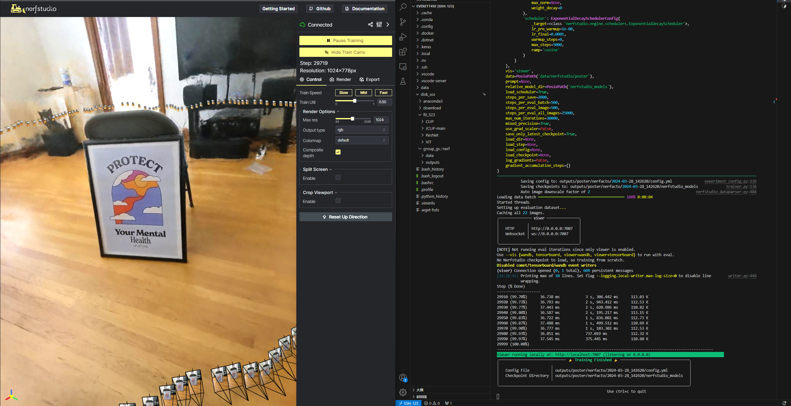

# Train Your First Model

[Training Your First Model](https://docs.nerf.studio/quickstart/first_nerf.html)

## Train and run viewer

1. Test dataset downloading: original order `ns-download-data nerfstudio --capture-name=poster` is not effective. I've uploaded the dataset to my cloud drive. Click [here](https://cloud.tsinghua.edu.cn/f/25b61d6d5e02483eb1fc/?dl=1) to download.
2. Train model: `ns-train nerfacto --data data/nerfstudio/poster`
    

## Use pretrained model

1. Load:

    ```text
    ns-train nerfacto --data data/nerfstudio/poster --load-dir {outputs/.../nerfstudio_models}
    ```

2. Visualize existing run:

    ```text
    ns-viewer --load-config {outputs/.../config.yml}
    ```

## Export results

1. Rendering vedio:
    - Add camera --> Generate command --> input --> success
    - When testing in environment `nerfstudio`, problem occurred: `Could not find ffmpeg. Please install ffmpeg`. Using `pip install ffmpeg` didn't work. Use `sudo apt install ffmpeg` instead.
2. Point cloud: `ply` file
3. Mesh: `obj` file
